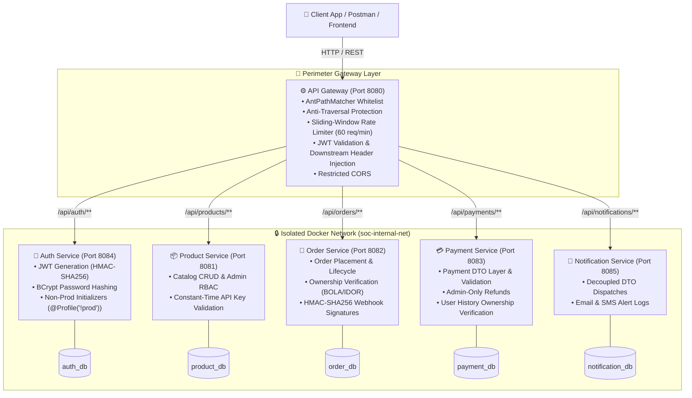

# 🛒 Online E-Commerce & Delivery System (SOC Microservices)


An enterprise-grade, fully secured microservices-based **Online E-Commerce & Delivery Platform** built with **Java 17**, **Spring Boot**, **Spring Cloud Gateway**, **JWT Authentication**, **HMAC-SHA256 Signatures**, **Role-Based Access Control (RBAC)**, **Isolated Docker Networks**, and **OWASP Hardening**.

---

## 📐 System Architecture

All client requests route through the centralized **Spring Cloud Gateway** (`Port 8080`). The Gateway enforces rate-limiting with trusted proxy validation, checks path traversal sequences, validates JWT signatures, and enriches requests with user roles and internal API keys before forwarding them over the private bridge network (`soc-internal-net`).



---

## 👥 Microservices & Database Architecture

Each microservice implements the **Database-per-Service** pattern with a dedicated MongoDB container. In Docker Compose, database containers do not expose public host ports and communicate exclusively within `soc-internal-net` with root authentication enabled:

| Student | Microservice / Role | Service Port | Database Name | Internal Mongo Host | Security Layer |
|---|---|:---:|:---:|---|---|
| **Student 1 (Lead)** | **API Gateway & Auth Service** | `8080` / `8084` | `auth_db` | `mongo-auth:27017` | JWT, Whitelist AntPathMatcher, Rate Limiter |
| **Student 2** | **Product Catalog Service** | `8081` | `product_db` | `mongo-product:27017` | `X-API-KEY` Constant-Time, `ROLE_ADMIN` RBAC |
| **Student 3** | **Order Service** | `8082` | `order_db` | `mongo-order:27017` | `X-API-KEY`, HMAC Webhooks, BOLA Checks |
| **Student 4** | **Payment Service** | `8083` | `payment_db` | `mongo-payment:27017` | `X-API-KEY`, DTO Layer, Admin Refunds |
| **Student 5** | **Notification Service** | `8085` | `notification_db` | `mongo-notification:27017` | `X-API-KEY`, DTO Encapsulation |

---

## 🚀 Microservices Overview & REST API Specifications

### 1. 🚪 API Gateway (`Port 8080`)
- **Dynamic Routing Rules:**
  - `/api/auth/**` ➔ Auth Service (`http://localhost:8084`)
  - `/api/products/**`, `/products/**` ➔ Product Service (`http://localhost:8081`)
  - `/api/orders/**`, `/api/v1/orders/**` ➔ Order Service (`http://localhost:8082`)
  - `/api/payments/**` ➔ Payment Service (`http://localhost:8083`)
  - `/api/notifications/**` ➔ Notification Service (`http://localhost:8085`)
- **Security Features:**
  - `AntPathMatcher` exact pattern whitelist matching (prevents substring bypass).
  - Path traversal and semicolon injection sanitization.
  - Proxy-aware sliding-window rate limiting (60 requests/minute).
  - Automatic `X-API-KEY`, `X-User-Name`, and `X-User-Role` header injection.
  - Strict CORS policy (locked to `http://localhost:3000`, `http://127.0.0.1:3000`).

---

### 2. 🔐 Auth Service (`Port 8084`)
- **Database:** MongoDB (`auth_db`)
- **Security:** Spring Security + BCrypt + JJWT HMAC-SHA256 (`@Profile("!prod")` seeders).

| Method | Endpoint | Description | Auth Required |
|---|---|---|---|
| `POST` | `/api/auth/register` | Register new user account | Public |
| `POST` | `/api/auth/login` | Authenticate credentials & get JWT | Public |
| `GET` | `/api/auth/validate` | Verify JWT token validity | Public |

---

### 3. 📦 Product Service (`Port 8081`)
- **Database:** MongoDB (`product_db`)
- **Security:** Constant-time `X-API-KEY` validation + `ROLE_ADMIN` RBAC for write/delete operations.

| Method | Endpoint | Description | Auth Required | Role Required |
|---|---|---|---|:---:|
| `GET` | `/products`, `/api/products` | Retrieve all products | `X-API-KEY` / JWT | Any |
| `GET` | `/products/{id}` | Get product details by ID | `X-API-KEY` / JWT | Any |
| `POST` | `/products` | Create product entry | `X-API-KEY` / JWT | `ROLE_ADMIN` |
| `DELETE` | `/products/{id}` | Delete product by ID | `X-API-KEY` / JWT | `ROLE_ADMIN` |

---

### 4. 🛒 Order Service (`Port 8082`)
- **Database:** MongoDB (`order_db`)
- **Security:** BOLA/IDOR ownership checks + HMAC-SHA256 signature verification on webhooks.

| Method | Endpoint | Description | Auth Required |
|---|---|---|---|
| `POST` | `/api/v1/orders` | Place new order with validated items | JWT Bearer |
| `GET` | `/api/v1/orders/{id}` | Fetch order details (Owner or Admin) | JWT Bearer |
| `GET` | `/api/v1/orders` | List caller's orders (or all if Admin) | JWT Bearer |
| `PATCH` | `/api/v1/orders/{id}/status` | Update order status | JWT Bearer |
| `PATCH` | `/api/v1/orders/{id}/delivery` | Update shipping dispatch details | JWT Bearer |
| `DELETE` | `/api/v1/orders/{id}` | Cancel order (Owner or Admin) | JWT Bearer |
| `POST` | `/api/v1/orders/{id}/payment-webhook` | Payment callback (`X-Signature-SHA256`) | HMAC-SHA256 |

---

### 5. 💳 Payment Service (`Port 8083`)
- **Database:** MongoDB (`payment_db`)
- **Security:** Decoupled `PaymentRequestDTO` / `PaymentResponseDTO`, IDOR protection on history, Admin-only refunds.

| Method | Endpoint | Description | Auth Required | Role Required |
|---|---|---|---|:---:|
| `POST` | `/api/payments/process` | Process new payment | `X-API-KEY` / JWT | Any |
| `GET` | `/api/payments/history/{userId}` | Retrieve user transaction history | `X-API-KEY` / JWT | Owner or Admin |
| `GET` | `/api/payments/{id}` | Fetch transaction by ID | `X-API-KEY` / JWT | Any |
| `POST` | `/api/payments/refund/{id}` | Process payment refund | `X-API-KEY` / JWT | `ROLE_ADMIN` |

---

### 6. 🔔 Notification Service (`Port 8085`)
- **Database:** MongoDB (`notification_db`)
- **Security:** Decoupled `NotificationRequestDTO` / `NotificationResponseDTO` with Bean Validation.

| Method | Endpoint | Description | Auth Required |
|---|---|---|---|
| `POST` | `/api/notifications/email` | Dispatch validated Email alert | `X-API-KEY` / JWT |
| `POST` | `/api/notifications/sms` | Dispatch validated SMS alert | `X-API-KEY` / JWT |
| `GET` | `/api/notifications/user/{userId}` | Fetch user notification logs | `X-API-KEY` / JWT |
| `GET` | `/api/notifications/{id}` | Fetch notification by ID | `X-API-KEY` / JWT |

---

## 🧪 End-to-End API Testing Guide

### Step A: Register User or Admin
```bash
curl -X POST http://localhost:8080/api/auth/register \
  -H "Content-Type: application/json" \
  -d '{
        "username": "alice",
        "password": "Password123!",
        "email": "alice@example.com",
        "role": "ROLE_ADMIN"
      }'
```

### Step B: Login & Retrieve JWT Token
```bash
curl -X POST http://localhost:8080/api/auth/login \
  -H "Content-Type: application/json" \
  -d '{
        "username": "alice",
        "password": "Password123!"
      }'
```

### Step C: Execute Protected Request via API Gateway
```bash
curl -X GET http://localhost:8080/api/products \
  -H "Authorization: Bearer <YOUR_JWT_TOKEN>"
```

### Step D: Execute Payment Webhook Callback (with HMAC Signature)
```bash
curl -X POST http://localhost:8080/api/v1/orders/ORD-12345/payment-webhook \
  -H "Content-Type: application/json" \
  -H "X-Signature-SHA256: <HMAC_HEX_SIGNATURE>" \
  -d '{
        "paymentTransactionId": "TXN-998877",
        "paymentStatus": "PAID",
        "amount": 1500.00,
        "paymentGateway": "STRIPE",
        "note": "Payment confirmed"
      }'
```

---

## 🐳 Quick Start & Deployment Guide

### Configuration Setup
Copy `.env.example` to `.env` and set your production secrets:
```bash
cp .env.example .env
```

### Run Entire Ecosystem with Docker Compose
```bash
# Build and launch all microservices and isolated databases
docker compose up --build -d

# View logs across all services
docker compose logs -f

# Stop and remove containers
docker compose down
```

### Run Automated Tests & Security Scans
```bash
# Run unit & regression tests across all services
mvn clean test

# Run OWASP Dependency Vulnerability Scan
mvn org.owasp:dependency-check-maven:check
```

---

## 📄 License & Attribution
Developed as part of the **SOC (Service-Oriented Computing)** course project.
