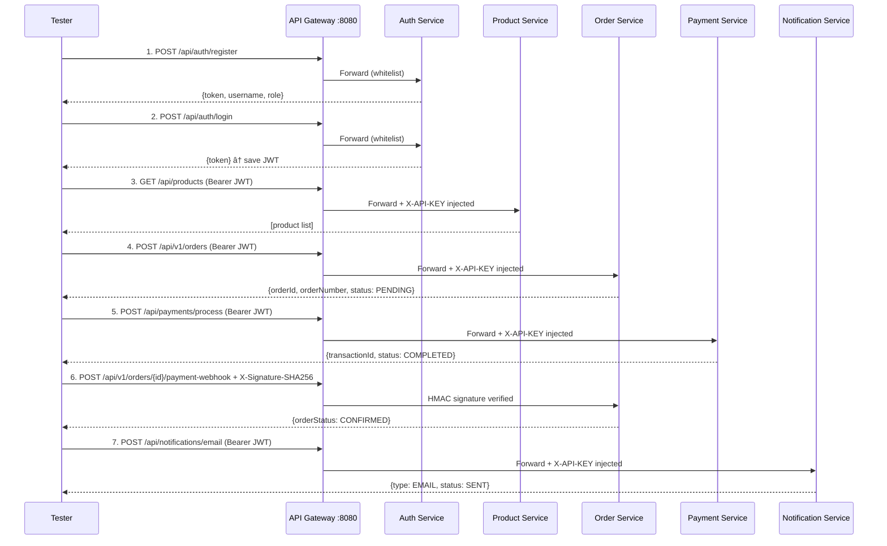

<div align="center">

# 🛒 SOC — Online E-Commerce & Delivery System

### Enterprise-grade, security-hardened microservices platform


</div>

---

## 📋 Table of Contents

- [Overview](#-overview)
- [Key Features](#-key-features)
- [System Architecture](#-system-architecture)
- [Technology Stack](#-technology-stack)
- [Microservices & Database Architecture](#-microservices--database-architecture)
- [Security Hardening](#-security-hardening)
- [Quick Start](#-quick-start)
- [Service URLs & Swagger UI](#-service-urls--swagger-ui)
- [REST API Reference](#-rest-api-reference)
- [API Testing Guide](#-api-testing-guide)
- [Project Structure](#-project-structure)
- [Documentation](#-documentation)
- [Contributing](#-contributing)
- [License](#-license)

---

## 🌐 Overview

**SOC** is a fully secured, enterprise-grade **Online E-Commerce & Delivery Platform** built as a distributed microservices system using **Java 17** and **Spring Boot 3.2.3**. All external traffic is funneled through a hardened **Spring Cloud Gateway** that enforces rate-limiting, path-traversal rejection, JWT signature validation, and role header injection — before requests ever reach an internal service.

The platform was developed as part of the **SOC (Service-Oriented Computing)** course and demonstrates production-grade patterns including Zero-Trust networking, OWASP-aligned security hardening, CI/CD pipelines, and database-per-service isolation.

---

## ✨ Key Features

- **5 Independent Microservices** — each with its own isolated MongoDB instance, no shared state
- **Zero-Trust Security Model** — JWT Bearer tokens, constant-time API key validation, RBAC, and BOLA/IDOR ownership checks at every layer
- **HMAC-SHA256 Webhook Signatures** — cryptographically verified payment callbacks
- **14 Security Vulnerabilities Resolved** — comprehensive OWASP audit with phased remediation
- **Sliding-Window Rate Limiting** — 60 req/min per IP with anti-X-Forwarded-For spoofing
- **Docker Compose One-Command Deployment** — 11 containers (6 services + 5 MongoDB instances) on an isolated private bridge network
- **Full CI/CD Pipeline** — GitHub Actions with automated tests and OWASP Dependency-Check on every push
- **Swagger UI** on every service for interactive API exploration
- **DTO Anti-Mass-Assignment Layer** — decoupled request/response contracts with Jakarta Bean Validation
- **Profile-Gated Data Seeders** — `@Profile("!prod")` ensures dev fixtures never run in production

---

## 📐 System Architecture

All client requests enter through the centralized **Spring Cloud Gateway** (`Port 8080`). The Gateway enforces rate limiting with trusted proxy validation, rejects path traversal sequences, validates JWT signatures, and enriches requests with user identity headers before forwarding them over the private bridge network (`soc-internal-net`).

```mermaid
flowchart TD
    Client[📱 Client App / Postman / Frontend]

    subgraph GatewayLayer ["🚪 Perimeter Gateway Layer"]
        Gateway["⚙️ API Gateway (Port 8080)<br/>• AntPathMatcher Whitelist<br/>• Anti-Traversal Protection (.., ;, %2f)<br/>• Sliding-Window Rate Limiter (60 req/min)<br/>• JWT Validation & Downstream Header Injection<br/>• Restricted CORS (localhost:3000 only)"]
    end

    subgraph InternalNetwork ["🔒 Isolated Docker Network (soc-internal-net)"]
        AuthService["🔐 Auth Service (Port 8084)<br/>• JWT Generation (HMAC-SHA256)<br/>• BCrypt Password Hashing<br/>• Non-Prod Seeders (@Profile('!prod'))"]
        ProductService["📦 Product Service (Port 8081)<br/>• Catalog CRUD & Admin RBAC<br/>• Constant-Time API Key Validation"]
        OrderService["🛒 Order Service (Port 8082)<br/>• Order Placement & Lifecycle<br/>• Ownership Verification (BOLA/IDOR)<br/>• HMAC-SHA256 Webhook Signatures"]
        PaymentService["💳 Payment Service (Port 8083)<br/>• Payment DTO Layer & Validation<br/>• Admin-Only Refunds<br/>• User History Ownership Verification"]
        NotificationService["🔔 Notification Service (Port 8085)<br/>• Decoupled DTO Dispatches<br/>• Email & SMS Alert Logs"]

        DB1[(auth_db)]
        DB2[(product_db)]
        DB3[(order_db)]
        DB4[(payment_db)]
        DB5[(notification_db)]

        AuthService --- DB1
        ProductService --- DB2
        OrderService --- DB3
        PaymentService --- DB4
        NotificationService --- DB5
    end

    Client -->|HTTP / REST| Gateway
    Gateway -->|/api/auth/**| AuthService
    Gateway -->|/api/products/**| ProductService
    Gateway -->|/api/v1/orders/**| OrderService
    Gateway -->|/api/payments/**| PaymentService
    Gateway -->|/api/notifications/**| NotificationService
```



### Request Lifecycle

Every request passes through a hardened filter chain before reaching business logic:

```mermaid
sequenceDiagram
    participant C as Client
    participant RL as RateLimitingFilter
    participant JWT as JwtAuthenticationFilter
    participant SVC as Downstream Service
    participant CTRL as Controller + RBAC

    C->>RL: HTTP Request + Bearer Token
    RL->>RL: Resolve real IP (trusted proxy subnet check)
    RL->>RL: Check sliding-window count

    alt Rate limit exceeded (>60/min)
        RL-->>C: 429 Too Many Requests (Retry-After: 60)
    else Within limit
        RL->>JWT: Forward request
        JWT->>JWT: Check path traversal (.., ;, %2f)
        alt Traversal detected
            JWT-->>C: 401 Forbidden path
        else Whitelisted endpoint
            JWT->>SVC: Pass-through (no JWT required)
        else Protected endpoint
            JWT->>JWT: Validate Bearer JWT (HS256)
            JWT->>SVC: Enriched request (X-User-Name, X-User-Role, X-API-KEY)
            SVC->>SVC: Constant-time MessageDigest.isEqual(X-API-KEY)
            CTRL->>CTRL: RBAC role check + IDOR ownership check
            CTRL-->>C: 200 OK + Response Body
        end
    end
```

---

## 🏗️ Technology Stack

| Component | Technology | Version |
|---|---|:---:|
| Language | Java | 17 |
| Framework | Spring Boot | 3.2.3 |
| API Gateway | Spring Cloud Gateway | 2023.0.0 |
| JWT Library | JJWT | 0.11.5 |
| Database | MongoDB | 7.0 |
| Containerization | Docker + Docker Compose | 3.8 |
| API Documentation | SpringDoc OpenAPI / Swagger UI | — |
| Code Generation | Lombok | — |
| Bean Validation | Jakarta Validation | — |
| Testing | JUnit 5 + Mockito + Reactor Test | — |
| Vulnerability Scan | OWASP Dependency-Check Maven Plugin | 9.0.9 |
| CI/CD | GitHub Actions | — |
| Build Tool | Maven Wrapper (`mvnw`) | — |

---

## 👥 Microservices & Database Architecture

The platform follows the **Database-per-Service** pattern. Each microservice owns a dedicated MongoDB container that does **not** expose a public host port — all database communication happens exclusively within the `soc-internal-net` private bridge network with root authentication enabled.

| Role | Microservice | Service Port | Database | Internal Mongo Host | Security Layer |
|---|---|:---:|:---:|---|---|
| **Lead — Gateway & Auth** | API Gateway + Auth Service | `8080` / `8084` | `auth_db` | `mongo-auth:27017` | JWT, AntPathMatcher Whitelist, Rate Limiter |
| **Product Catalog** | Product Service | `8081` | `product_db` | `mongo-product:27017` | `X-API-KEY` Constant-Time, `ROLE_ADMIN` RBAC |
| **Order Management** | Order Service | `8082` | `order_db` | `mongo-order:27017` | `X-API-KEY`, HMAC-SHA256 Webhooks, BOLA/IDOR |
| **Payment Processing** | Payment Service | `8083` | `payment_db` | `mongo-payment:27017` | `X-API-KEY`, DTO Layer, Admin-Only Refunds |
| **Notifications** | Notification Service | `8085` | `notification_db` | `mongo-notification:27017` | `X-API-KEY`, DTO Encapsulation, Bean Validation |

---

## 🛡️ Security Hardening

All **14 security vulnerabilities** identified in the [Security & QA Audit Report](docs/security-audit-report.md) have been resolved across 4 phased patches:

| Phase | Security Patch | Status |
|---|---|:---:|
| **1** | Database network isolation — no public host ports on MongoDB containers | ✅ |
| **1** | `AntPathMatcher` whitelist + path traversal hardening in Gateway JWT filter | ✅ |
| **1** | All secrets externalized to `.env` with `@Value` injection | ✅ |
| **1** | Constant-time `MessageDigest.isEqual` API key validation (prevents timing attacks) | ✅ |
| **2** | `ROLE_ADMIN` RBAC on product write/delete and payment refund endpoints | ✅ |
| **2** | BOLA/IDOR ownership checks on orders and payment history | ✅ |
| **2** | HMAC-SHA256 webhook signature verification for payment callbacks | ✅ |
| **2** | CORS restricted to explicit trusted origins (`localhost:3000`) | ✅ |
| **2** | Rate limiting with trusted proxy subnet validation (anti-`X-Forwarded-For` spoofing) | ✅ |
| **3** | `@Profile("!prod")` guard on all `DataInitializer` seeders | ✅ |
| **3** | Decoupled DTO layer for Payment & Notification (anti-mass assignment) | ✅ |
| **3** | Centralized `GlobalExceptionHandler` across all services | ✅ |
| **4** | Unit & Mockito regression test suites for all microservices | ✅ |
| **4** | GitHub Actions CI/CD + OWASP Dependency-Check integration | ✅ |

> See [Security Architecture](docs/architecture/security.md) and [Remediation Plan](docs/remediation-plan.md) for full details.

---

## 🚀 Quick Start

### Prerequisites

| Tool | Version | Purpose |
|---|---|---|
| Docker Desktop | 24+ | Container runtime and orchestration |
| Java JDK | 17+ | Local development |
| Maven | 3.8+ (or use included `mvnw`) | Build tool |
| Git | any | Source code management |
| MongoDB Compass | any | Optional — GUI for database inspection |

### 1. Clone the Repository

```bash
git clone https://github.com/mrawfulshadow/SOC_project.git
cd SOC_project
```

### 2. Configure Environment Secrets

```bash
cp .env.example .env
```

Edit `.env` and fill in your secrets:

```env
JWT_SECRET=<base64-encoded-hmac-key>
PRODUCT_SERVICE_API_KEY=<your-product-key>
ORDER_SERVICE_API_KEY=<your-order-key>
PAYMENT_SERVICE_API_KEY=<your-payment-key>
NOTIFICATION_SERVICE_API_KEY=<your-notification-key>
WEBHOOK_SECRET=<your-hmac-webhook-secret>
MONGO_ROOT_USERNAME=admin
MONGO_ROOT_PASSWORD=<strong-password>
```

> **Production:** Set `SPRING_PROFILES_ACTIVE=prod` to disable `DataInitializer` seeders and prevent default accounts from being created.

### 3. Launch All Services

```bash
# Build and start all 11 containers (6 services + 5 MongoDB instances)
docker compose up --build -d

# Verify all containers are healthy
docker compose ps

# Stream logs
docker compose logs -f
```

### 4. Run Tests & Security Scans

```bash
# Unit and integration tests
mvn clean test

# OWASP Dependency Vulnerability Scan
mvn org.owasp:dependency-check-maven:check -DfailBuildOnCVSS=8
```

### 5. Stop Services

```bash
docker compose down        # Stop (preserves volumes)
docker compose down -v     # Stop and remove all data
```

> For local Maven development, per-service logs, and troubleshooting, see the [Deployment Guide](docs/guides/deployment.md).

---

## 🔌 Service URLs & Swagger UI

| Service | Local URL | Swagger UI |
|---|---|---|
| **API Gateway** | http://localhost:8080 | — |
| **Auth Service** | http://localhost:8084 | — |
| **Product Service** | http://localhost:8081 | http://localhost:8081/swagger-ui.html |
| **Order Service** | http://localhost:8082 | http://localhost:8082/swagger-ui.html |
| **Payment Service** | http://localhost:8083 | http://localhost:8083/swagger-ui.html |
| **Notification Service** | http://localhost:8085 | http://localhost:8085/swagger-ui.html |
| **Client App** | http://localhost:3000 | — |

### MongoDB Compass (Direct Database Inspection)

| Service | Database | Compass URI |
|---|---|---|
| Auth Service | `auth_db` | `mongodb://localhost:27022` |
| Product Service | `product_db` | `mongodb://localhost:27018` |
| Order Service | `order_db` | `mongodb://localhost:27019` |
| Payment Service | `payment_db` | `mongodb://localhost:27020` |
| Notification Service | `notification_db` | `mongodb://localhost:27021` |

---

## 📡 REST API Reference

### 🚪 API Gateway (`Port 8080`)

| Route Prefix | Forwarded To | Security Applied |
|---|---|---|
| `/api/auth/**` | Auth Service `:8084` | Whitelist (public) |
| `/api/products/**`, `/products/**` | Product Service `:8081` | JWT + X-API-KEY injection |
| `/api/v1/orders/**` | Order Service `:8082` | JWT + X-API-KEY injection |
| `/api/payments/**` | Payment Service `:8083` | JWT + X-API-KEY injection |
| `/api/notifications/**` | Notification Service `:8085` | JWT + X-API-KEY injection |

---

### 🔐 Auth Service (`Port 8084`)

**Database:** `auth_db` · **Security:** Spring Security + BCrypt + JJWT HMAC-SHA256

| Method | Endpoint | Description | Auth |
|---|---|---|---|
| `POST` | `/api/auth/register` | Register a new user account | Public |
| `POST` | `/api/auth/login` | Authenticate & receive JWT | Public |
| `GET` | `/api/auth/validate` | Verify JWT token validity | Public |

---

### 📦 Product Service (`Port 8081`)

**Database:** `product_db` · **Security:** Constant-time `X-API-KEY` + `ROLE_ADMIN` RBAC

| Method | Endpoint | Description | Auth | Role |
|---|---|---|---|:---:|
| `GET` | `/api/products` | List all products | JWT Bearer | Any |
| `GET` | `/api/products/{id}` | Get product by ID | JWT Bearer | Any |
| `POST` | `/api/products` | Create new product | JWT Bearer | `ROLE_ADMIN` |
| `DELETE` | `/api/products/{id}` | Delete product | JWT Bearer | `ROLE_ADMIN` |

---

### 🛒 Order Service (`Port 8082`)

**Database:** `order_db` · **Security:** BOLA/IDOR ownership checks + HMAC-SHA256 webhook verification

| Method | Endpoint | Description | Auth |
|---|---|---|---|
| `POST` | `/api/v1/orders` | Place a new order | JWT Bearer |
| `GET` | `/api/v1/orders` | List orders (own, or all if Admin) | JWT Bearer |
| `GET` | `/api/v1/orders/{id}` | Fetch order (owner or Admin only) | JWT Bearer |
| `PATCH` | `/api/v1/orders/{id}/status` | Update order status | JWT Bearer |
| `PATCH` | `/api/v1/orders/{id}/delivery` | Update delivery tracking info | JWT Bearer |
| `DELETE` | `/api/v1/orders/{id}` | Cancel order (owner or Admin) | JWT Bearer |
| `POST` | `/api/v1/orders/{id}/payment-webhook` | Payment callback (HMAC-SHA256 required) | `X-Signature-SHA256` |

---

### 💳 Payment Service (`Port 8083`)

**Database:** `payment_db` · **Security:** DTO Layer + IDOR protection + Admin-only refunds

| Method | Endpoint | Description | Auth | Role |
|---|---|---|---|:---:|
| `POST` | `/api/payments/process` | Process a payment | JWT Bearer | Any |
| `GET` | `/api/payments/{id}` | Get transaction by ID | JWT Bearer | Any |
| `GET` | `/api/payments/history/{userId}` | Get user payment history | JWT Bearer | Owner / Admin |
| `POST` | `/api/payments/refund/{id}` | Issue a refund | JWT Bearer | `ROLE_ADMIN` |

---

### 🔔 Notification Service (`Port 8085`)

**Database:** `notification_db` · **Security:** DTO-decoupled dispatches with Bean Validation

| Method | Endpoint | Description | Auth |
|---|---|---|---|
| `POST` | `/api/notifications/email` | Send an email notification | JWT Bearer |
| `POST` | `/api/notifications/sms` | Send an SMS notification | JWT Bearer |
| `GET` | `/api/notifications/user/{userId}` | Fetch user notification history | JWT Bearer |
| `GET` | `/api/notifications/{id}` | Fetch notification by ID | JWT Bearer |

---

## 🧪 API Testing Guide

All requests route through the API Gateway at `http://localhost:8080`.



### Step 1 — Register & Login

```bash
# Register an admin user
curl -X POST http://localhost:8080/api/auth/register \
  -H "Content-Type: application/json" \
  -d '{"username":"alice_admin","password":"AdminPass123!","email":"alice@example.com","role":"ROLE_ADMIN"}'

# Login and save the returned token
curl -X POST http://localhost:8080/api/auth/login \
  -H "Content-Type: application/json" \
  -d '{"username":"alice_admin","password":"AdminPass123!"}'
```

### Step 2 — Browse Products & Place Order

```bash
# List products
curl http://localhost:8080/api/products \
  -H "Authorization: Bearer <YOUR_JWT>"

# Place an order
curl -X POST http://localhost:8080/api/v1/orders \
  -H "Authorization: Bearer <YOUR_JWT>" \
  -H "Content-Type: application/json" \
  -d '{
    "customerId": "alice_admin",
    "customerEmail": "alice@example.com",
    "customerPhone": "+94771234567",
    "shippingAddress": {
      "street": "123 Main Street", "city": "Colombo",
      "state": "Western", "zipCode": "00300", "country": "Sri Lanka"
    },
    "items": [{"productId":"PROD-101","productName":"Wireless Headphones","unitPrice":150.00,"quantity":2}]
  }'
```

### Step 3 — Payment Webhook (HMAC-SHA256)

```bash
# Compute HMAC-SHA256 signature
BODY='{"paymentTransactionId":"TXN-A1B2C3D4","paymentStatus":"PAID","amount":300.00,"paymentGateway":"STRIPE","note":"Approved"}'
SIGNATURE=$(echo -n "$BODY" | openssl dgst -sha256 -hmac "your-webhook-secret" | awk '{print $2}')

# Send the signed webhook
curl -X POST http://localhost:8080/api/v1/orders/<ORDER_ID>/payment-webhook \
  -H "Content-Type: application/json" \
  -H "X-Signature-SHA256: $SIGNATURE" \
  -d "$BODY"
```

### Error Reference

| Status | Cause | Response |
|:---:|---|---|
| `400` | Validation error | `{"status":400,"error":"Validation Failed"}` |
| `401` | Missing / invalid JWT | `{"error":"Invalid or Expired JWT Token","status":401}` |
| `401` | Bad API key | `Unauthorized: Invalid or missing API Key` |
| `401` | Invalid webhook signature | `{"error":"Invalid webhook signature","status":401}` |
| `403` | Insufficient role | `Access denied: Admin role required` |
| `404` | Resource not found | `{"error":"Order not found","status":404}` |
| `429` | Rate limit exceeded (>60/min) | `{"error":"Too Many Requests","status":429}` |
| `500` | Unexpected server error | `{"error":"An unexpected error occurred","status":500}` |

> For the complete **15-step end-to-end walkthrough** (SMS, delivery tracking, refund, notification history), see the [API Testing Guide](docs/guides/api-testing.md).  
> A **Postman collection** is available at [`docs/postman/Order_Service.postman_collection.json`](docs/postman/Order_Service.postman_collection.json).

---

## 📁 Project Structure

```
SOC/
├── api-gateway/              # Spring Cloud Gateway — JWT, rate limiting, routing, CORS
├── auth-service/             # Authentication — JWT issuance, BCrypt, user management
├── product-service/          # Product catalog CRUD with ROLE_ADMIN RBAC
├── order-service/            # Order lifecycle, HMAC webhooks, BOLA/IDOR protection
├── payment-service/          # Payment processing, refunds, IDOR protection
├── notification-service/     # Email & SMS notification dispatch
├── client-app/               # Static frontend served via Nginx (port 3000)
├── docs/
│   ├── architecture/
│   │   ├── overview.md       # System architecture, design patterns, tech stack
│   │   ├── security.md       # JWT flow, HMAC, RBAC, rate limiting, filter chain
│   │   └── data-models.md    # MongoDB collections and document schemas
│   ├── guides/
│   │   ├── deployment.md     # Docker Compose, local Maven, CI/CD, troubleshooting
│   │   └── api-testing.md    # 15-step end-to-end cURL testing guide
│   ├── services/             # Per-service detailed API documentation
│   ├── postman/              # Postman collection for Order Service
│   ├── security-audit-report.md   # Full vulnerability audit & risk matrix
│   └── remediation-plan.md        # Phased patching roadmap & verification commands
├── scripts/                  # Helper build & test automation scripts
├── docker-compose.yml        # Full ecosystem orchestration (11 containers)
├── .env.example              # Environment variable template
├── CONTRIBUTING.md
└── README.md
```

---

## 📚 Documentation

| Document | Description |
|---|---|
| [Architecture Overview](docs/architecture/overview.md) | System design, patterns, technology stack, port reference |
| [Security Architecture](docs/architecture/security.md) | JWT flow, HMAC webhooks, RBAC, rate limiting, filter chain, CORS |
| [Data Models](docs/architecture/data-models.md) | MongoDB collection schemas, ER diagram, sample documents |
| [Deployment Guide](docs/guides/deployment.md) | Docker Compose, local Maven dev, environment variables, troubleshooting |
| [API Testing Guide](docs/guides/api-testing.md) | Complete 15-step end-to-end cURL testing walkthrough |
| [API Gateway](docs/services/api-gateway.md) | Routing rules, JWT filter, anti-traversal, rate limiting, CORS |
| [Auth Service](docs/services/auth-service.md) | Registration, login, JWT token management, exception handling |
| [Product Service](docs/services/product-service.md) | Catalog CRUD, RBAC admin protection, constant-time key validation |
| [Order Service](docs/services/order-service.md) | Order lifecycle, HMAC webhooks, BOLA/IDOR protection, delivery tracking |
| [Payment Service](docs/services/payment-service.md) | Payment DTO layer, transaction processing, admin refunds |
| [Notification Service](docs/services/notification-service.md) | DTO-decoupled Email & SMS dispatch, notification logs |
| [Security Audit Report](docs/security-audit-report.md) | Full vulnerability audit, risk matrix, and findings |
| [Remediation Plan](docs/remediation-plan.md) | Phased patching roadmap, task checklist & verification commands |

---

## 🤝 Contributing

We welcome contributions! Please read [CONTRIBUTING.md](CONTRIBUTING.md) for our workflow, conventions, and standards:

- **Git Workflow** — GitHub Flow with PR-based merging; `main` is always deployable
- **Commit Convention** — [Conventional Commits](https://www.conventionalcommits.org/) (`feat`, `fix`, `security`, `docs`, `chore`)
- **Branch Naming** — `feat/short-desc`, `fix/issue-desc`, `security/patch-desc`
- **Code Standards** — Java 17, Bean Validation on all DTOs, `@Profile("!prod")` on seeders, no plaintext secrets

```bash
git clone https://github.com/mrawfulshadow/SOC_project.git
cd SOC_project
cp .env.example .env
docker compose up --build -d
```

---

## 📄 License

Developed as part of the **SOC (Service-Oriented Computing)** course project.  
All contributions are subject to the project's academic integrity guidelines.

---

<div align="center">

**Built with Java 17 · Spring Boot 3.2.3 · Spring Cloud Gateway · MongoDB 7.0 · Docker**

</div>
