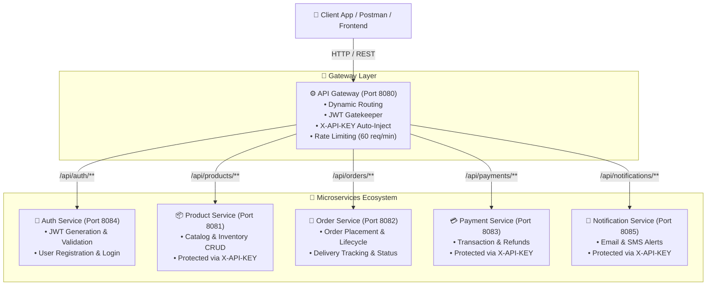

# 🛒 Online E-Commerce & Delivery System (SOC Microservices)


An enterprise-grade, microservices-based **Online E-Commerce & Delivery Platform** built with **Java 17**, **Spring Boot**, **Spring Cloud Gateway**, **JWT Authentication**, and **Docker**.

---

## 📐 System Architecture

The ecosystem uses an **API Gateway pattern** where all external client requests pass through a centralized Spring Cloud Gateway entry point (Port `8080`). The Gateway validates user JWT tokens, enforces rate limiting, and forwards authorized requests to independent downstream microservices while auto-injecting internal `X-API-KEY` headers.



---

## 👥 Team Work Breakdown Matrix

| Student | Microservice / Role | Key Responsibilities | Port | Interactive Swagger UI |
|---|---|---|:---:|---|
| **Student 1 (Lead)** | **API Gateway & Auth Service** | Gateway Routing, JWT Gatekeeper Filter, API Key Auto-Injection, CORS, Rate Limiting, User Auth & Registration | `8080` / `8084` | [Auth Service Swagger](http://localhost:8084/swagger-ui.html) |
| **Student 2** | **Product Catalog Service** | Product & Category CRUD, Inventory Management, `X-API-KEY` Security Filter | `8081` | [Product Service Swagger](http://localhost:8081/swagger-ui.html) |
| **Student 3** | **Order Service** | Order Placement, Lifecycle Tracking (`PENDING` ➔ `DELIVERED`), Webhook Updates | `8082` | [Order Service Swagger](http://localhost:8082/swagger-ui.html) |
| **Student 4** | **Payment Service** | Transaction Processing, Payment History, Refund Processing, `X-API-KEY` Security | `8083` | [Payment Service Swagger](http://localhost:8083/swagger-ui/index.html) |
| **Student 5** | **Notification Service** | Email & SMS Notifications, Dispatch Logs, `X-API-KEY` Security Filter | `8085` | [Notification Service Swagger](http://localhost:8085/swagger-ui/index.html) |

---

## 🚀 Microservices Overview & REST API Specifications

### 1. 🚪 API Gateway (`Port 8080`)
The single entry point for all client requests.
- **Dynamic Routing Rules:**
  - `/api/auth/**` ➔ Auth Service (`http://localhost:8084`)
  - `/api/products/**` ➔ Product Service (`http://localhost:8081`)
  - `/api/orders/**` ➔ Order Service (`http://localhost:8082`)
  - `/api/payments/**` ➔ Payment Service (`http://localhost:8083`)
  - `/api/notifications/**` ➔ Notification Service (`http://localhost:8085`)
- **Key Features:**
  - **JWT Authentication Filter:** Validates `Authorization: Bearer <token>` and propagates `X-User-Name` & `X-User-Role` downstream.
  - **Auto-Inject API Key Filter:** Seamlessly attaches service-specific `X-API-KEY` headers before invoking downstream services.
  - **Rate Limiting:** Protects endpoints against abuse (60 requests/min per IP).

---

### 2. 🔐 Auth Service (`Port 8084`)
Provides centralized user authentication and JWT token issuance.
- **Database:** H2 In-Memory (`jdbc:h2:mem:authdb`)
- **Security:** Spring Security + BCrypt Password Encoder + JJWT

| Method | Endpoint | Description | Auth Required |
|---|---|---|---|
| `POST` | `/api/auth/register` | Register a new user | Public |
| `POST` | `/api/auth/login` | Authenticate user & receive JWT token | Public |
| `GET` | `/api/auth/validate` | Validate JWT token (`?token=...`) | Public |

---

### 3. 📦 Product Service (`Port 8081`)
Manages catalog inventory and details.
- **Header Security:** `X-API-KEY: PRODUCT-SERVICE-SECRET-KEY`

| Method | Endpoint | Description | Auth Required |
|---|---|---|---|
| `GET` | `/products` | Retrieve all products | `X-API-KEY` |
| `GET` | `/products/{id}` | Get product details by ID | `X-API-KEY` |
| `POST` | `/products` | Create a new product entry | `X-API-KEY` |
| `DELETE` | `/products/{id}` | Delete product by ID | `X-API-KEY` |

---

### 4. 🛒 Order Service (`Port 8082`)
Manages shopping cart, order placement, and order state progression.

| Method | Endpoint | Description | Auth Required |
|---|---|---|---|
| `POST` | `/api/v1/orders` | Place a new order | JWT Bearer |
| `GET` | `/api/v1/orders/{id}` | Fetch order details by ID | JWT Bearer |
| `GET` | `/api/v1/orders` | List orders (supports filters) | JWT Bearer |
| `PATCH` | `/api/v1/orders/{id}/status` | Update order status | JWT Bearer |
| `POST` | `/api/v1/orders/{id}/payment-webhook` | Payment callback trigger | Internal |

---

### 5. 💳 Payment Service (`Port 8083`)
Processes payment transactions, maintains audit history, and handles refunds.
- **Header Security:** `X-API-KEY: payment-secret-key-123`

| Method | Endpoint | Description | Auth Required |
|---|---|---|---|
| `POST` | `/api/payments/process` | Process new payment | `X-API-KEY` |
| `GET` | `/api/payments/history/{userId}` | Retrieve user transaction history | `X-API-KEY` |
| `GET` | `/api/payments/{id}` | Fetch transaction by ID | `X-API-KEY` |
| `POST` | `/api/payments/refund/{id}` | Process a payment refund | `X-API-KEY` |

---

### 6. 🔔 Notification Service (`Port 8085`)
Dispatches automated Email and SMS notifications for orders and payments.
- **Header Security:** `X-API-KEY: notification-secret-key-123`

| Method | Endpoint | Description | Auth Required |
|---|---|---|---|
| `POST` | `/api/notifications/email` | Dispatch Email alert | `X-API-KEY` |
| `POST` | `/api/notifications/sms` | Dispatch SMS alert | `X-API-KEY` |
| `GET` | `/api/notifications/user/{userId}` | Fetch user notification logs | `X-API-KEY` |

---

## 🧪 End-to-End API Testing Guide

### Step A: Register a New User
```bash
curl -X POST http://localhost:8080/api/auth/register \
  -H "Content-Type: application/json" \
  -d '{
        "username": "john_doe",
        "password": "Password123!",
        "email": "john@example.com",
        "role": "ROLE_USER"
      }'
```

### Step B: Login & Retrieve JWT Token
```bash
curl -X POST http://localhost:8080/api/auth/login \
  -H "Content-Type: application/json" \
  -d '{
        "username": "john_doe",
        "password": "Password123!"
      }'
```
*Extract the `"token"` value from the JSON response.*

### Step C: Execute Request via API Gateway
```bash
curl -X GET http://localhost:8080/api/payments/history/5 \
  -H "Authorization: Bearer <YOUR_JWT_TOKEN>"
```
*The API Gateway validates your JWT and automatically attaches `X-API-KEY: payment-secret-key-123` upstream.*

---

## 🐳 Quick Start & Deployment Guide

### Option 1: Run Entire Ecosystem with Docker Compose (Recommended)

Ensure Docker Desktop is running, then execute from the project root:

```bash
# Build and launch all microservices in background
docker compose up --build -d

# View real-time aggregated logs
docker compose logs -f

# Shut down all microservices
docker compose down
```

### Option 2: Run Microservices Individually with Maven

```bash
# Run Auth Service
cd auth-service && ./mvnw spring-boot:run

# Run Product Service
cd product-service && ./mvnw spring-boot:run

# Run Order Service
cd order-service && ./mvnw spring-boot:run

# Run Payment Service
cd payment-service && ./mvnw spring-boot:run

# Run Notification Service
cd notification-service && ./mvnw spring-boot:run

# Run API Gateway
cd api-gateway && ./mvnw spring-boot:run
```

---

## 📄 License & Attribution
Developed as part of the **SOC (Service-Oriented Computing)** course project.
