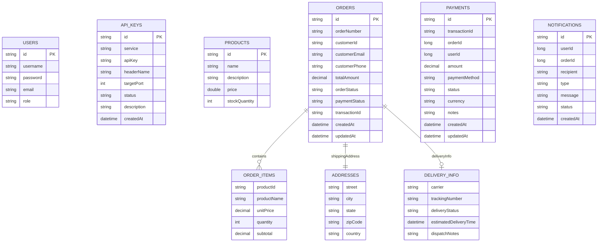

# Data Models

## Database Architecture

The platform follows the **Database-per-Service** pattern. Each microservice owns an isolated MongoDB 7.0 instance with no public host port exposure (internal `soc-internal-net` bridge network only, with root authentication). This ensures:

- **Loose coupling** — schema changes in one service do not affect others
- **Independent scaling** — each database can be scaled individually
- **Data isolation** — no cross-service database queries
- **Network isolation** — databases are unreachable from outside the Docker bridge network

> **DTO Layer Note:** The `Payment` and `Notification` MongoDB documents are never exposed directly over HTTP. All API requests and responses use decoupled `*RequestDTO` / `*ResponseDTO` classes, preventing mass assignment attacks (client-side injection of `status`, `transactionId`, or `createdAt`).

---

## Entity Relationship Overview



---

## Auth Service — `auth_db`

**MongoDB URI:** `mongodb://localhost:27022/auth_db`

### Collection: `users`

| Field | Type | Constraints | Description |
|---|---|---|---|
| `_id` | `String` | Primary Key | MongoDB ObjectId |
| `username` | `String` | Unique, Indexed | User login identifier |
| `password` | `String` | — | BCrypt-encoded password hash |
| `email` | `String` | Unique, Indexed | User email address |
| `role` | `String` | — | Authority (e.g., `ROLE_USER`, `ROLE_ADMIN`) |

**Sample document:**
```json
{
  "_id": "64a1b2c3d4e5f60001234567",
  "username": "john_doe",
  "password": "$2a$10$...",
  "email": "john@example.com",
  "role": "ROLE_USER"
}
```

### Collection: `api_keys`

| Field | Type | Constraints | Description |
|---|---|---|---|
| `_id` | `String` | Primary Key | MongoDB ObjectId |
| `service` | `String` | Unique, Indexed | Service identifier name |
| `apiKey` | `String` | Unique, Indexed | Secret key value |
| `headerName` | `String` | — | HTTP header name (e.g., `X-API-KEY`) |
| `targetPort` | `int` | — | Service port number |
| `status` | `String` | — | Key status (`ACTIVE`, `REVOKED`) |
| `description` | `String` | — | Human-readable description |
| `createdAt` | `LocalDateTime` | — | Creation timestamp |

---

## Product Service — `product_db`

**MongoDB URI:** `mongodb://localhost:27018/product_db`

### Collection: `products`

| Field | Type | Constraints | Description |
|---|---|---|---|
| `_id` | `String` | Primary Key | MongoDB ObjectId |
| `name` | `String` | — | Product display name |
| `description` | `String` | — | Product description text |
| `price` | `double` | — | Unit price |
| `stockQuantity` | `int` | — | Available inventory count |

**Sample document:**
```json
{
  "_id": "64b2c3d4e5f600012345ab",
  "name": "Wireless Headphones",
  "description": "Noise-cancelling Bluetooth headphones",
  "price": 150.00,
  "stockQuantity": 50
}
```

---

## Order Service — `order_db`

**MongoDB URI:** `mongodb://localhost:27019/order_db`

### Collection: `orders`

The `Order` document is the most complex in the system, embedding sub-documents for items, address, and delivery.

| Field | Type | Description |
|---|---|---|
| `_id` | `String` | MongoDB ObjectId (Primary Key) |
| `orderNumber` | `String` | Human-readable ref, e.g., `ORD-20260822-A1B2C3` |
| `customerId` | `String` | Customer identifier |
| `customerEmail` | `String` | Customer email address |
| `customerPhone` | `String` | Customer phone number |
| `shippingAddress` | `Address` | Embedded address document |
| `items` | `List<OrderItem>` | List of ordered items |
| `totalAmount` | `BigDecimal` | Calculated sum of all item subtotals |
| `orderStatus` | `OrderStatus` | Enum — current order state |
| `paymentStatus` | `PaymentStatus` | Enum — payment state |
| `transactionId` | `String` | Payment transaction reference |
| `deliveryInfo` | `DeliveryInfo` | Embedded delivery tracking document |
| `createdAt` | `LocalDateTime` | Order creation timestamp |
| `updatedAt` | `LocalDateTime` | Last modification timestamp |

**Embedded: `Address`**

| Field | Type |
|---|---|
| `street` | `String` |
| `city` | `String` |
| `state` | `String` |
| `zipCode` | `String` |
| `country` | `String` |

**Embedded: `OrderItem`**

| Field | Type | Description |
|---|---|---|
| `productId` | `String` | Product identifier reference |
| `productName` | `String` | Product name snapshot |
| `unitPrice` | `BigDecimal` | Price per unit at time of order |
| `quantity` | `int` | Quantity ordered |
| `subtotal` | `BigDecimal` | `unitPrice * quantity` |

**Embedded: `DeliveryInfo`**

| Field | Type | Description |
|---|---|---|
| `carrier` | `String` | Courier name (e.g., DHL, FedEx) |
| `trackingNumber` | `String` | Carrier tracking reference |
| `deliveryStatus` | `DeliveryStatus` | Current delivery state |
| `estimatedDeliveryTime` | `LocalDateTime` | Estimated delivery date/time |
| `dispatchNotes` | `String` | Additional dispatch notes |

**Enumerations:**

```
OrderStatus:   PENDING → CONFIRMED → PROCESSING → OUT_FOR_DELIVERY → DELIVERED
                                                                    → CANCELLED (from any except DELIVERED/OUT_FOR_DELIVERY)

PaymentStatus: PENDING → PAID
                       → FAILED
               PAID    → REFUNDED

DeliveryStatus: PENDING → IN_TRANSIT → OUT_FOR_DELIVERY → DELIVERED → RETURNED
```

**Order Number Format:** `ORD-{YYYYMMDD}-{6-char UUID suffix uppercase}`

**Sample document:**
```json
{
  "_id": "64c3d4e5f60001234567cd",
  "orderNumber": "ORD-20260822-A1B2C3",
  "customerId": "CUST-1001",
  "customerEmail": "john@example.com",
  "customerPhone": "+94771234567",
  "shippingAddress": {
    "street": "123 Main Street",
    "city": "Colombo",
    "state": "Western",
    "zipCode": "00300",
    "country": "Sri Lanka"
  },
  "items": [
    {
      "productId": "PROD-101",
      "productName": "Wireless Headphones",
      "unitPrice": 150.00,
      "quantity": 2,
      "subtotal": 300.00
    }
  ],
  "totalAmount": 300.00,
  "orderStatus": "PENDING",
  "paymentStatus": "PENDING",
  "transactionId": null,
  "deliveryInfo": null,
  "createdAt": "2026-08-22T22:00:00",
  "updatedAt": "2026-08-22T22:00:00"
}
```

---

## Payment Service — `payment_db`

**MongoDB URI:** `mongodb://localhost:27020/payment_db`

### Collection: `payments`

| Field | Type | Constraints | Description |
|---|---|---|---|
| `_id` | `String` | Primary Key | MongoDB ObjectId |
| `transactionId` | `String` | Unique, Indexed | Auto-generated: `TXN-{8-char-UUID}` |
| `orderId` | `Long` | Indexed | Reference to order |
| `userId` | `Long` | Indexed | Reference to user |
| `amount` | `BigDecimal` | — | Payment amount |
| `paymentMethod` | `String` | — | `CREDIT_CARD`, `PAYPAL`, `BANK_TRANSFER`, `CASH_ON_DELIVERY` |
| `status` | `String` | — | `PENDING`, `COMPLETED`, `FAILED`, `REFUNDED` |
| `currency` | `String` | Default: `LKR` | `LKR`, `USD`, `EUR` |
| `notes` | `String` | — | Additional notes or failure reason |
| `createdAt` | `LocalDateTime` | — | Processing timestamp |
| `updatedAt` | `LocalDateTime` | — | Last update timestamp |

---

## Notification Service — `notification_db`

**MongoDB URI:** `mongodb://localhost:27021/notification_db`

### Collection: `notifications`

| Field | Type | Description |
|---|---|---|
| `_id` | `String` | MongoDB ObjectId (Primary Key) |
| `userId` | `Long` | Target user identifier |
| `orderId` | `Long` | Related order identifier |
| `recipient` | `String` | Email address or phone number |
| `type` | `String` | `EMAIL` or `SMS` |
| `message` | `String` | Notification message body |
| `status` | `String` | `SENT` or `FAILED` |
| `createdAt` | `LocalDateTime` | Dispatch timestamp |

---

## MongoDB Connection Reference

| Service | Database Name | MongoDB URI | Compass URI |
|---|---|---|---|
| Auth Service | `auth_db` | `mongodb://auth-mongodb:27017/auth_db` | `mongodb://localhost:27022` |
| Product Service | `product_db` | `mongodb://product-mongodb:27017/product_db` | `mongodb://localhost:27018` |
| Order Service | `order_db` | `mongodb://order-mongodb:27017/order_db` | `mongodb://localhost:27019` |
| Payment Service | `payment_db` | `mongodb://payment-mongodb:27017/payment_db` | `mongodb://localhost:27020` |
| Notification Service | `notification_db` | `mongodb://notification-mongodb:27017/notification_db` | `mongodb://localhost:27021` |

> **Note:** The Docker Compose internal URIs use the container hostname (e.g., `auth-mongodb`), while MongoDB Compass uses `localhost` with the mapped host port.
