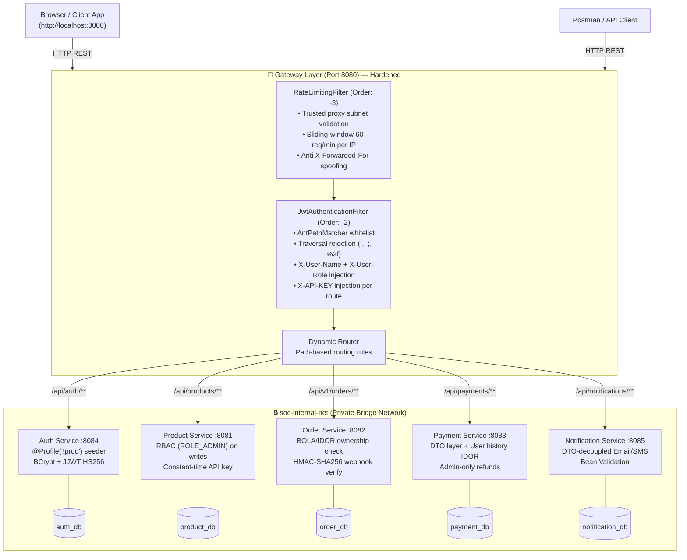
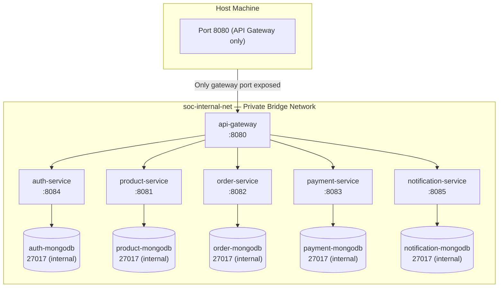

# Architecture Overview

## Design Philosophy

The SOC E-Commerce platform is built on four core architectural principles:

- **API Gateway Pattern** — all external traffic enters through a single hardened entry point at port `8080`
- **Database-per-Service Pattern** — each microservice owns a dedicated, isolated MongoDB instance ensuring full data autonomy with no shared state
- **Token-based Security** — JWT tokens carry user identity across services; API keys (constant-time verified) establish inter-service trust
- **Zero-Trust Hardening** — every layer enforces authentication, authorization, input validation, and secrets isolation; no service trusts any caller by default

---

## High-Level System Diagram



---

## Request Lifecycle (Hardened)

```mermaid
sequenceDiagram
    participant C as Client
    participant RL as RateLimitingFilter
    participant JWT as JwtAuthenticationFilter
    participant SVC as Downstream Service
    participant CTRL as Controller + RBAC

    C->>RL: HTTP Request + Bearer Token
    RL->>RL: Resolve real IP (proxy subnet check)
    RL->>RL: Check sliding-window count

    alt Rate limit exceeded (>60/min)
        RL-->>C: 429 Too Many Requests (Retry-After: 60)
    else Within limit
        RL->>JWT: Forward request
        JWT->>JWT: Check path traversal (.., ;, %2f)
        alt Traversal detected
            JWT-->>C: 401 Forbidden path
        else
            JWT->>JWT: AntPathMatcher whitelist check
            alt Whitelisted endpoint
                JWT->>SVC: Pass-through (no JWT required)
            else Protected endpoint
                JWT->>JWT: Check Authorization header
                alt Missing
                    JWT-->>C: 401 Missing Authorization Header
                else Has Bearer token
                    JWT->>JWT: Parse JWT with HS256 key
                    alt Invalid or expired
                        JWT-->>C: 401 Invalid or Expired JWT Token
                    else Valid
                        JWT->>JWT: Extract username + role
                        JWT->>SVC: Enriched request (X-User-Name, X-User-Role, X-API-KEY)
                        SVC->>SVC: Constant-time MessageDigest.isEqual(X-API-KEY)
                        SVC->>CTRL: Validated request
                        CTRL->>CTRL: RBAC role check + IDOR ownership check
                        CTRL-->>C: 200 OK + Response Body
                    end
                end
            end
        end
    end
```

---

## Docker Network Topology (Post-Hardening)



> **MongoDB instances do NOT expose host ports** — they are accessible only within `soc-internal-net` with root authentication configured via `MONGO_INITDB_ROOT_USERNAME` / `MONGO_INITDB_ROOT_PASSWORD`.

---

## Technology Stack

| Component | Technology | Version |
|---|---|:---:|
| Language | Java | 17 |
| Framework | Spring Boot | 3.2.3 |
| Gateway | Spring Cloud Gateway | 2023.0.0 |
| JWT Library | JJWT | 0.11.5 |
| Database | MongoDB | 7.0 |
| Container Runtime | Docker | latest |
| Orchestration | Docker Compose | 3.8 |
| API Documentation | SpringDoc OpenAPI | — |
| Code Generation | Lombok | — |
| Bean Validation | Jakarta Validation | — |
| Testing | JUnit 5 + Mockito + Reactor Test | — |
| Vulnerability Scan | OWASP Dependency-Check | 9.0.9 |
| CI/CD | GitHub Actions | — |
| Build Tool | Maven Wrapper | — |

---

## Port Reference

| Service | Host Port | Internal Port | MongoDB Access |
|---|:---:|:---:|---|
| API Gateway | `8080` | `8080` | — |
| Auth Service | `8084` | `8084` | `mongo-auth:27017` (internal) |
| Product Service | `8081` | `8081` | `mongo-product:27017` (internal) |
| Order Service | `8082` | `8082` | `mongo-order:27017` (internal) |
| Payment Service | `8083` | `8083` | `mongo-payment:27017` (internal) |
| Notification Service | `8085` | `8085` | `mongo-notification:27017` (internal) |
