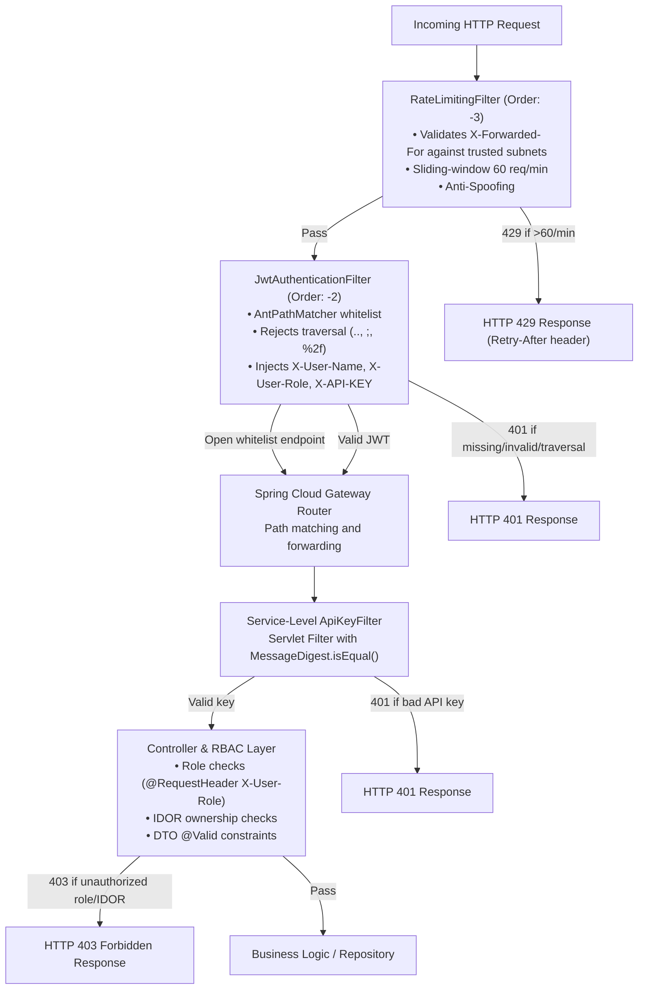

# Security Architecture

## Overview

The platform implements a multi-layered, enterprise-grade zero-trust security architecture:

1. **Gateway Perimeter Layer** — Dynamic routing, AntPathMatcher whitelist matching, path traversal rejection, sliding-window rate limiting with trusted proxy subnet validation, and JWT validation.
2. **Internal Service-to-Service Layer** — Injected `X-API-KEY` headers with constant-time (`MessageDigest.isEqual`) verification.
3. **Role-Based Access Control (RBAC)** — Propagated `X-User-Role` headers enforced at downstream controllers (e.g. `ROLE_ADMIN` for product creation/deletion and payment refunds).
4. **Broken Object-Level Authorization (BOLA/IDOR) Protection** — User identity matching between `X-User-Name` and requested resource owners.
5. **Cryptographic Webhook Signatures** — HMAC-SHA256 signature verification on payment status callbacks (`POST /api/v1/orders/{id}/payment-webhook`).
6. **Data Contract Integrity (Anti-Mass Assignment)** — Decoupled Request/Response DTOs with Jakarta Bean Validation.
7. **Network & Secrets Isolation** — Internal Docker bridge network (`soc-internal-net`) with unexposed database ports and strict `.env` secret externalization.

---

## JWT Authentication Flow

```mermaid
sequenceDiagram
    participant C as Client
    participant GW as API Gateway
    participant AUTH as Auth Service
    participant SVC as Protected Service

    Note over C,AUTH: Step 1 - Registration & Login (public endpoints)
    C->>GW: POST /api/auth/register
    GW->>GW: Exact prefix match: /api/auth/register (Bypasses JWT check)
    GW->>AUTH: Forward request
    AUTH->>AUTH: Validate uniqueness, BCrypt password, save User
    AUTH->>AUTH: JwtUtil.generateToken(username, role)
    AUTH-->>C: {token, username, role, expiresIn}

    Note over C,SVC: Step 2 - Authenticated Request
    C->>GW: GET /api/products + Authorization: Bearer <JWT>
    GW->>GW: Check path traversal & sanitization (rejects .., ;, %2f)
    GW->>GW: Extract token from header
    GW->>GW: Jwts.parserBuilder().setSigningKey(HS256Key).parseClaimsJws(token)
    GW->>GW: Extract subject=username, claim role
    GW->>GW: Mutate request: add X-User-Name, X-User-Role
    GW->>GW: Inject X-API-KEY: PRODUCT-SERVICE-SECRET-KEY
    GW->>SVC: Enriched request
    SVC->>SVC: Constant-time MessageDigest.isEqual(X-API-KEY)
    SVC->>SVC: Check RBAC / Ownership
    SVC-->>C: 200 OK + data
```

---

## Filter Chain Execution Order



---

## Open vs Protected Endpoints

| Endpoint | Gateway Auth | Microservice Auth | Authorization Constraints |
|---|:---:|:---:|---|
| `POST /api/auth/register` | Open (Whitelist) | None | Public registration |
| `POST /api/auth/login` | Open (Whitelist) | None | Public login |
| `GET /api/auth/validate` | Open (Whitelist) | None | Token validation |
| `/swagger-ui/**` | Open | Open (Exact Prefix) | API documentation UI |
| `/v3/api-docs/**` | Open | Open (Exact Prefix) | OpenAPI schema |
| `GET /api/products` | JWT Bearer | `X-API-KEY` | Any authenticated user |
| `POST /api/products` | JWT Bearer | `X-API-KEY` | `ROLE_ADMIN` only |
| `DELETE /api/products/{id}` | JWT Bearer | `X-API-KEY` | `ROLE_ADMIN` only |
| `POST /api/v1/orders` | JWT Bearer | `X-API-KEY` | Caller is order creator |
| `GET /api/v1/orders/{id}` | JWT Bearer | `X-API-KEY` | Order owner or `ROLE_ADMIN` |
| `DELETE /api/v1/orders/{id}` | JWT Bearer | `X-API-KEY` | Order owner or `ROLE_ADMIN` |
| `POST /api/v1/orders/{id}/payment-webhook` | Public Callback | `X-API-KEY` | `X-Signature-SHA256` HMAC required |
| `POST /api/payments/process` | JWT Bearer | `X-API-KEY` | Authenticated user / order service |
| `GET /api/payments/history/{userId}` | JWT Bearer | `X-API-KEY` | Target userId matches caller or `ROLE_ADMIN` |
| `POST /api/payments/refund/{id}` | JWT Bearer | `X-API-KEY` | `ROLE_ADMIN` only |
| `POST /api/notifications/**` | JWT Bearer | `X-API-KEY` | Authenticated service |

---

## Cryptographic Payment Webhook Verification

Payment callback endpoints require an `X-Signature-SHA256` header:
1. Payment processor generates an `HMAC-SHA256` digest of the callback payload using the shared secret `WEBHOOK_SECRET`.
2. `order-service` computes `HMAC-SHA256` over the payload using its configured `webhook.secret`.
3. Verifies authenticity using `MessageDigest.isEqual(...)` in constant-time.
4. Requests with missing or forged signatures are rejected with `HTTP 401 Unauthorized`.

---

## Hardened Rate Limiting & Proxy Trust

- **Anti-Spoofing:** The `X-Forwarded-For` header is only trusted if the direct connection originates from a trusted reverse proxy (loopback, RFC 1918 private subnets `10.0.0.0/8`, `172.16.0.0/12`, `192.168.0.0/16`, or configured IPs).
- Direct external clients attempting to send fake `X-Forwarded-For` headers have their actual remote IP enforced.
- Responses include `Retry-After: 60` and `HTTP 429 Too Many Requests`.

---

## CORS Configuration

- Permissive wildcards (`allowedOrigins: "*"`) are eliminated.
- Explicit trusted frontend origins are configured (`http://localhost:3000`, `http://127.0.0.1:3000`).
- Allowed HTTP methods are locked down to `GET, POST, PUT, PATCH, DELETE, OPTIONS`.
