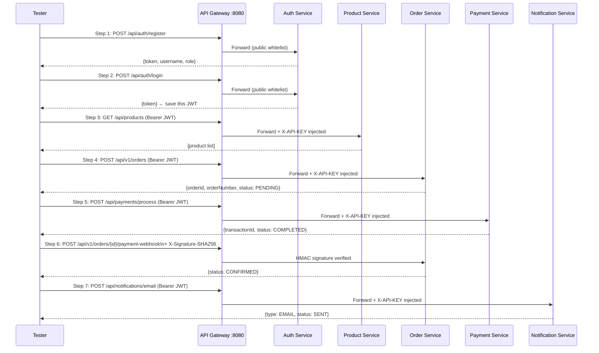

# API Testing Guide

## Overview

This guide provides a complete, step-by-step walkthrough for testing the SOC E-Commerce platform end-to-end using cURL. All requests are routed through the API Gateway at `http://localhost:8080`.

> **Prerequisite:** Ensure all services are running. See the [Deployment Guide](deployment.md).

> **Note:** The payment webhook endpoint (Step 8) requires an `X-Signature-SHA256` HMAC header. See Step 8 for how to compute it.

---

## End-to-End Testing Flow



---

## Step 1: Register a New Admin User

```bash
curl -X POST http://localhost:8080/api/auth/register \
  -H "Content-Type: application/json" \
  -d '{
    "username": "alice_admin",
    "password": "AdminPass123!",
    "email": "alice@example.com",
    "role": "ROLE_ADMIN"
  }'
```

**Expected Response (`200 OK`):**
```json
{
  "token": "eyJhbGciOiJIUzI1NiJ9...",
  "username": "alice_admin",
  "role": "ROLE_ADMIN",
  "message": "User registered successfully",
  "expiresIn": 86400000
}
```

---

## Step 2: Login and Retrieve JWT Token

```bash
curl -X POST http://localhost:8080/api/auth/login \
  -H "Content-Type: application/json" \
  -d '{
    "username": "alice_admin",
    "password": "AdminPass123!"
  }'
```

**Expected Response (`200 OK`):**
```json
{
  "token": "eyJhbGciOiJIUzI1NiJ9...",
  "username": "alice_admin",
  "role": "ROLE_ADMIN",
  "message": "Authentication successful",
  "expiresIn": 86400000
}
```

> **Save the `token` value.** Replace `<YOUR_JWT>` in all subsequent steps.

---

## Step 3: Validate Your Token

```bash
curl "http://localhost:8080/api/auth/validate?token=<YOUR_JWT>"
```

**Expected Response:** `true`

---

## Step 4: Browse the Product Catalog

```bash
curl http://localhost:8080/api/products \
  -H "Authorization: Bearer <YOUR_JWT>"
```

---

## Step 5: Create a Product (Admin required)

```bash
curl -X POST http://localhost:8080/api/products \
  -H "Authorization: Bearer <YOUR_JWT>" \
  -H "Content-Type: application/json" \
  -d '{
    "name": "Mechanical Keyboard",
    "description": "Tenkeyless RGB, Cherry MX Blue",
    "price": 89.99,
    "stockQuantity": 30
  }'
```

**Expected Response (`201 Created`):** Product JSON with generated `id`.

> **403 Forbidden** if JWT role is not `ROLE_ADMIN`.

---

## Step 6: Place an Order

```bash
curl -X POST http://localhost:8080/api/v1/orders \
  -H "Authorization: Bearer <YOUR_JWT>" \
  -H "Content-Type: application/json" \
  -d '{
    "customerId": "alice_admin",
    "customerEmail": "alice@example.com",
    "customerPhone": "+94771234567",
    "shippingAddress": {
      "street": "123 Main Street",
      "city": "Colombo",
      "state": "Western",
      "zipCode": "00300",
      "country": "Sri Lanka"
    },
    "items": [
      {
        "productId": "PROD-101",
        "productName": "Wireless Headphones",
        "unitPrice": 150.00,
        "quantity": 2
      }
    ]
  }'
```

**Expected Response (`201 Created`):**
```json
{
  "id": "64c3d4e5f60001234567cd",
  "orderNumber": "ORD-20260822-A1B2C3",
  "totalAmount": 300.00,
  "orderStatus": "PENDING",
  "paymentStatus": "PENDING"
}
```

> **Save the `id` value as `<ORDER_ID>`** for subsequent steps.

---

## Step 7: Process a Payment

```bash
curl -X POST http://localhost:8080/api/payments/process \
  -H "Authorization: Bearer <YOUR_JWT>" \
  -H "Content-Type: application/json" \
  -d '{
    "orderId": 1001,
    "userId": 1,
    "amount": 300.00,
    "paymentMethod": "CREDIT_CARD",
    "currency": "LKR"
  }'
```

**Expected Response (`201 Created`):**
```json
{
  "id": "64d4e5f6001234567890ab",
  "transactionId": "TXN-A1B2C3D4",
  "status": "COMPLETED",
  "amount": 300.00,
  "currency": "LKR"
}
```

> **Save** `transactionId` as `<TXN_ID>`.

---

## Step 8: Trigger Payment Webhook (Confirm Order)

The webhook endpoint requires an `X-Signature-SHA256` header — an HMAC-SHA256 digest of the raw JSON body using the shared `WEBHOOK_SECRET`.

**Compute the signature (Linux/macOS):**
```bash
BODY='{"paymentTransactionId":"TXN-A1B2C3D4","paymentStatus":"PAID","amount":300.00,"paymentGateway":"STRIPE","note":"Approved"}'
SIGNATURE=$(echo -n "$BODY" | openssl dgst -sha256 -hmac "your-webhook-secret" | awk '{print $2}')
```

**Send the webhook:**
```bash
curl -X POST http://localhost:8080/api/v1/orders/<ORDER_ID>/payment-webhook \
  -H "Content-Type: application/json" \
  -H "X-Signature-SHA256: $SIGNATURE" \
  -d "$BODY"
```

**Expected Response (`200 OK`):**
```json
{
  "orderStatus": "CONFIRMED",
  "paymentStatus": "PAID",
  "transactionId": "TXN-A1B2C3D4"
}
```

> Without the `X-Signature-SHA256` header or with a mismatched signature: **`401 Unauthorized`**.

---

## Step 9: Check Order Status

```bash
curl http://localhost:8080/api/v1/orders/<ORDER_ID> \
  -H "Authorization: Bearer <YOUR_JWT>"
```

**Expected Response:** Full order JSON with `orderStatus: CONFIRMED`.

---

## Step 10: Update Delivery Tracking

```bash
curl -X PATCH http://localhost:8080/api/v1/orders/<ORDER_ID>/delivery \
  -H "Authorization: Bearer <YOUR_JWT>" \
  -H "Content-Type: application/json" \
  -d '{
    "deliveryStatus": "IN_TRANSIT",
    "carrier": "DHL Express",
    "trackingNumber": "DHL-SL-998822",
    "estimatedDeliveryTime": "2026-09-01T17:00:00",
    "dispatchNotes": "Picked up by rider at 22:30"
  }'
```

**Expected Response (`200 OK`):** Updated order with `deliveryInfo` populated.

---

## Step 11: Send Email Notification

```bash
curl -X POST http://localhost:8080/api/notifications/email \
  -H "Authorization: Bearer <YOUR_JWT>" \
  -H "Content-Type: application/json" \
  -d '{
    "userId": 1,
    "orderId": 1001,
    "recipient": "alice@example.com",
    "message": "Your order ORD-20260822-A1B2C3 has been dispatched via DHL Express."
  }'
```

**Expected Response (`201 Created`):**
```json
{
  "id": "64e5f6001234567890abcd",
  "type": "EMAIL",
  "status": "SENT",
  "createdAt": "2026-08-22T22:30:00"
}
```

---

## Step 12: Send SMS Notification

```bash
curl -X POST http://localhost:8080/api/notifications/sms \
  -H "Authorization: Bearer <YOUR_JWT>" \
  -H "Content-Type: application/json" \
  -d '{
    "userId": 1,
    "orderId": 1001,
    "recipient": "+94771234567",
    "message": "Order dispatched! Track: DHL-SL-998822"
  }'
```

---

## Step 13: View Notification History

```bash
curl http://localhost:8080/api/notifications/user/1 \
  -H "Authorization: Bearer <YOUR_JWT>"
```

---

## Step 14: View Payment History

```bash
curl http://localhost:8080/api/payments/history/1 \
  -H "Authorization: Bearer <YOUR_JWT>"
```

---

## Step 15: Process a Refund (Admin required)

```bash
curl -X POST http://localhost:8080/api/payments/refund/<PAYMENT_ID> \
  -H "Authorization: Bearer <YOUR_JWT>" \
  -H "Content-Type: application/json" \
  -d '{
    "reason": "Customer requested order cancellation"
  }'
```

**Expected Response (`200 OK`):**
```json
{
  "transactionId": "TXN-A1B2C3D4",
  "status": "REFUNDED",
  "notes": "Customer requested order cancellation"
}
```

> **403 Forbidden** if JWT role is not `ROLE_ADMIN`.

---

## Error Response Reference

| HTTP Status | Scenario | Example Response |
|:---:|---|---|
| `400` | Validation error (missing required field) | `{"status":400,"error":"Validation Failed","message":"..."}` |
| `401` | Missing or invalid JWT | `{"error": "Invalid or Expired JWT Token", "status": 401}` |
| `401` | Missing or wrong API key | `Unauthorized: Invalid or missing API Key` |
| `401` | Invalid webhook signature | `{"error":"Invalid webhook signature","status":401}` |
| `403` | Insufficient role (non-admin calling admin endpoint) | `Access denied: Admin role required` |
| `404` | Resource not found | `{"error": "Order not found", "status": 404}` |
| `429` | Rate limit exceeded (> 60 req/min) | `{"error": "Too Many Requests", "status": 429}` |
| `500` | Unexpected server error | `{"error":"An unexpected error occurred","status":500}` |

---

## Swagger UI Quick Links

| Service | Swagger UI URL |
|---|---|
| Product Service | http://localhost:8081/swagger-ui.html |
| Order Service | http://localhost:8082/swagger-ui.html |
| Payment Service | http://localhost:8083/swagger-ui.html |
| Notification Service | http://localhost:8085/swagger-ui.html |
