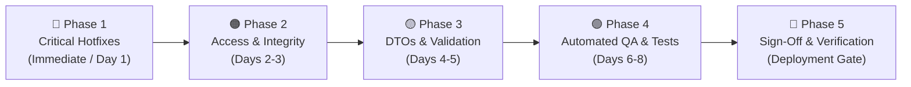

# 🛠️ Security Remediation & Patch Plan

**Project:** Online E-Commerce & Delivery System (SOC Microservices Architecture)  
**Document Version:** 1.0.0  
**Target Release:** Sprint Security Hardening v1.1.0  
**Associated Audit:** [Security & QA Audit Report](security-audit-report.md)  
**Status:** 🟡 Pending Implementation  

---

## 📌 Overview & Strategy

This document provides a phased, actionable remediation plan and checklist to resolve all vulnerabilities identified in the **Security & QA Audit Report**.



---

## 🗓️ Phase-Wise Remediation Roadmap

---

### 🔴 Phase 1: Critical Security Hotfixes (Immediate / Day 1)
> **Goal:** Close active remote code execution, authentication bypass, and direct database access vectors.

#### Patch 1.1: Fix Gateway URL Matching & Auth Bypass
* **Target File:** `api-gateway/src/main/java/com/soc/apigateway/filter/JwtAuthenticationFilter.java`
* **Tasks:**
  - [x] Replace `OPEN_ENDPOINTS.stream().anyMatch(path::contains)` with exact prefix/pattern matching.
  - [x] Use Spring's `PathPattern` or `AntPathMatcher` matching against whitelist patterns (`/api/auth/register`, `/api/auth/login`, `/api/auth/validate`).
  - [x] Reject path traversal sequences (`..`, `;`, URL-encoded slashes `%2f`).

#### Patch 1.2: Fix Microservice `ApiKeyFilter` Substring Whitelist Bypass
* **Target Files:**
  - `product-service/src/main/java/com/soc/productservice/config/ApiKeyFilter.java`
  - `payment-service/src/main/java/com/soc/paymentservice/config/ApiKeyFilter.java`
  - `notification-service/src/main/java/com/soc/notificationservice/config/ApiKeyFilter.java`
* **Tasks:**
  - [x] Replace `path.contains("swagger") || path.contains("api-docs")` with exact prefix checking (`path.startsWith("/swagger-ui") || path.startsWith("/v3/api-docs")`).
  - [x] Use constant-time comparison `MessageDigest.isEqual()` to prevent timing attacks during API key validation.

#### Patch 1.3: Database Isolation & Docker Network Security
* **Target File:** `docker-compose.yml`
* **Tasks:**
  - [x] Remove public host port bindings (`27018:27017`, `27019:27017`, etc.) from all 5 MongoDB containers.
  - [x] Attach all microservices and databases to a dedicated internal Docker bridge network (`soc-internal-net`).
  - [x] Configure MongoDB authentication (`MONGO_INITDB_ROOT_USERNAME`, `MONGO_INITDB_ROOT_PASSWORD`).

#### Patch 1.4: Externalize Secrets & Credentials
* **Target Files:**
  - `.env.example` & `.env`
  - `auth-service/src/main/resources/application.properties`
  - `api-gateway/src/main/resources/application.yml`
* **Tasks:**
  - [x] Create `.env` file template with placeholders for `JWT_SECRET`, `PRODUCT_API_KEY`, `ORDER_API_KEY`, `PAYMENT_API_KEY`, `NOTIFICATION_API_KEY`.
  - [x] Update Spring configuration files to read secrets strictly from environment variables without default hardcoded fallbacks in production.

---

### 🟠 Phase 2: Access Control, Webhook Security & Rate Limiting (Days 2-3)
> **Goal:** Prevent unauthorized data access (BOLA/IDOR), privilege escalation, and webhook manipulation.

#### Patch 2.1: Enforce Role-Based Access Control (RBAC) in Downstream Services
* **Target Files:**
  - `product-service/src/main/java/com/soc/productservice/controller/ProductController.java`
  - `payment-service/src/main/java/com/soc/paymentservice/controller/PaymentController.java`
* **Tasks:**
  - [x] Add `@RequestHeader(value = "X-User-Role", required = false)` checks or Spring Security pre-authorization.
  - [x] Restrict product creation/deletion (`POST /products`, `DELETE /products/{id}`) to `ROLE_ADMIN`.
  - [x] Restrict refund processing (`POST /api/payments/refund/{id}`) to `ROLE_ADMIN` or verified payment processors.

#### Patch 2.2: Prevent Broken Object-Level Authorization (BOLA/IDOR)
* **Target Files:**
  - `order-service/src/main/java/com/ecommerce/orderservice/controller/OrderController.java`
  - `payment-service/src/main/java/com/soc/paymentservice/controller/PaymentController.java`
* **Tasks:**
  - [x] Verify that the user requested in `GET /api/payments/history/{userId}` matches `X-User-Name` or has `ROLE_ADMIN`.
  - [x] Verify in `OrderService.getOrderByIdOrNumber` and `cancelOrder` that `order.customerId` matches the caller.

#### Patch 2.3: Implement HMAC-SHA256 Signature Verification on Payment Webhooks
* **Target Files:**
  - `order-service/src/main/java/com/ecommerce/orderservice/controller/OrderController.java`
  - `order-service/src/main/java/com/ecommerce/orderservice/service/impl/OrderServiceImpl.java`
* **Tasks:**
  - [x] Require `X-Signature-SHA256` header on `POST /api/v1/orders/{id}/payment-webhook`.
  - [x] Calculate HMAC-SHA256 over request body using a shared webhook secret and compare signatures.
  - [x] Reject requests with invalid or missing signatures with `HTTP 401 Unauthorized`.

#### Patch 2.4: Rate Limiting & Proxy Trust Hardening
* **Target File:** `api-gateway/src/main/java/com/soc/apigateway/filter/RateLimitingFilter.java`
* **Tasks:**
  - [x] Validate `X-Forwarded-For` against trusted proxy subnets before using client IP.
  - [x] Provide optional Redis-based backing for cluster-ready rate limiting.

#### Patch 2.5: Restrict Global CORS Configuration
* **Target File:** `api-gateway/src/main/resources/application.yml`
* **Tasks:**
  - [x] Replace wildcard `allowedOrigins: "*"` with explicit trusted origins (`http://localhost:3000`, `http://127.0.0.1:3000`).
  - [x] Restrict allowed HTTP methods to `GET, POST, PUT, PATCH, DELETE, OPTIONS`.

---

### 🟡 Phase 3: DTO Layer, Validation & Error Standardization (Days 4-5)
> **Goal:** Eliminate Mass Assignment risks, ensure clean data contracts, and prevent information disclosure.

#### Patch 3.1: DTO Layer Separation in Payment & Notification Services
* **Target Files:**
  - `payment-service/src/main/java/com/soc/paymentservice/dto/` (New DTO package)
  - `notification-service/src/main/java/com/soc/notificationservice/dto/` (New DTO package)
* **Tasks:**
  - [x] Create `PaymentRequestDTO` and `PaymentResponseDTO` to decouple MongoDB document from HTTP body.
  - [x] Create `NotificationRequestDTO` and `NotificationResponseDTO`.
  - [x] Prevent client-side injection of `status`, `transactionId`, or `createdAt`.

#### Patch 3.2: Input Validation Constraints
* **Target Files:** All Controller and DTO classes
* **Tasks:**
  - [x] Add Jakarta Bean Validation annotations (`@NotNull`, `@Positive`, `@NotBlank`, `@Email`) across all request DTOs.
  - [x] Add `@Valid` annotations to all Controller `@RequestBody` arguments.

#### Patch 3.3: Centralized Exception Handling
* **Target Files:**
  - `auth-service/src/main/java/com/soc/authservice/exception/GlobalExceptionHandler.java`
  - `payment-service/src/main/java/com/soc/paymentservice/exception/GlobalExceptionHandler.java`
  - `product-service/src/main/java/com/soc/productservice/exception/GlobalExceptionHandler.java`
* **Tasks:**
  - [x] Implement `@RestControllerAdvice` across all microservices matching `order-service` standard.
  - [x] Sanitize stack traces to avoid leaking internal framework details in HTTP 500 responses.

#### Patch 3.4: Restrict Database Initializers to Non-Production
* **Target Files:**
  - `auth-service/src/main/java/com/soc/authservice/config/DataInitializer.java`
  - `product-service/src/main/java/com/soc/productservice/config/DataInitializer.java`
* **Tasks:**
  - [x] Add `@Profile("!prod")` or `@Profile("dev")` to all initializers seeding default accounts.

---

### 🟢 Phase 4: Automated Testing & Verification (Days 6-8)
> **Goal:** Build automated test coverage ensuring no security regressions occur.

#### Patch 4.1: Unit & Mockito Test Suites
* **Tasks:**
  - [x] `auth-service`: Tests for registration uniqueness, password encoding, JWT issuance, and expiration.
  - [x] `product-service`: Service CRUD tests and role check validations.
  - [x] `payment-service`: Transaction processing, amount validation, and refund logic tests.
  - [x] `notification-service`: Notification persistence and dispatch tests.

#### Patch 4.2: API Gateway Security Regression Tests
* **Tasks:**
  - [x] Test JWT filter rejection of expired/tampered tokens.
  - [x] Test that path bypass attempts (e.g., `/api/orders?x=/swagger-ui`) receive `401 Unauthorized`.
  - [x] Test API key injection and rate-limit triggering at 61 requests/minute.

#### Patch 4.3: End-to-End Integration Tests & CI/CD Pipeline
* **Tasks:**
  - [x] Add GitHub Actions / CI workflow to run `./mvnw test` on all modules.
  - [x] Integrate OWASP Dependency-Check plugin in `pom.xml` to flag vulnerable libraries.

---

## 📋 Comprehensive Quality & Security Verification Checklist

Use this interactive matrix to track the implementation status of all remediation items:

| ID | Vulnerability / Task | Target Module | Phase | Priority | Status | Verified By |
|:---:|---|---|:---:|:---:|:---:|:---:|
| **SEC-01** | Remove host port bindings from MongoDB services | `docker-compose.yml` | 1 | 🔴 Critical | ✅ Completed | Fixed |
| **SEC-02** | Replace `path.contains` in Gateway JWT filter | `api-gateway` | 1 | 🔴 Critical | ✅ Completed | Fixed |
| **SEC-03** | Externalize JWT secret and API keys to `.env` | Configs / Root | 1 | 🔴 Critical | ✅ Completed | Fixed |
| **SEC-04** | Fix substring matching in `ApiKeyFilter` | Product / Payment / Notif | 1 | 🔴 Critical | ✅ Completed | Fixed |
| **SEC-05** | Restrict Admin endpoints (`DELETE /products`, `refund`) | Product / Payment | 2 | 🟠 High | ✅ Completed | Fixed |
| **SEC-06** | Enforce User ID match on payment history & orders | Order / Payment | 2 | 🟠 High | ✅ Completed | Fixed |
| **SEC-07** | Implement HMAC-SHA256 webhook signature check | Order Service | 2 | 🟠 High | ✅ Completed | Fixed |
| **SEC-08** | Restrict CORS allowed origins to explicit frontend | API Gateway | 2 | 🟡 Medium | ✅ Completed | Fixed |
| **SEC-09** | Sanitize `X-Forwarded-For` in RateLimitingFilter | API Gateway | 2 | 🟡 Medium | ✅ Completed | Fixed |
| **SEC-10** | Gate default credential seeding behind `@Profile("!prod")` | Auth / Product | 3 | 🟡 Medium | ✅ Completed | Fixed |
| **SEC-11** | Create DTOs & prevent direct entity exposure | Payment / Notif | 3 | 🟡 Medium | ✅ Completed | Fixed |
| **SEC-12** | Implement centralized `GlobalExceptionHandler` | All Services | 3 | 🟢 Low | ✅ Completed | Fixed |
| **SEC-13** | Add unit tests for Auth, Product, Payment, Notif | All Services | 4 | 🟢 Low | ✅ Completed | Fixed |
| **SEC-14** | Add automated Gateway security test cases | API Gateway | 4 | 🟢 Low | ✅ Completed | Fixed |

---

## 🚀 Execution & Verification Commands

### 1. Build and Test All Microservices
```bash
# Run unit and integration tests across all microservices
cd auth-service && ./mvnw clean test
cd ../product-service && ./mvnw clean test
cd ../order-service && ./mvnw clean test
cd ../payment-service && ./mvnw clean test
cd ../notification-service && ./mvnw clean test
cd ../api-gateway && ./mvnw clean test
```

### 2. Verify Security Fixes Locally
```bash
# 1. Attempt unauthenticated call with fake bypass query (Must return 401 Unauthorized)
curl -i -X GET "http://localhost:8080/api/orders?bypass=/swagger-ui"

# 2. Attempt direct call to internal microservice without API key (Must return 401 Unauthorized)
curl -i -X GET "http://localhost:8081/products"

# 3. Attempt payment webhook without HMAC signature (Must return 401 Unauthorized)
curl -i -X POST "http://localhost:8080/api/v1/orders/ORD-12345/payment-webhook" \
  -H "Content-Type: application/json" \
  -d '{"transactionId":"TXN-1","paymentStatus":"PAID"}'
```

---

*Remediation Plan approved by Lead QA & Security Officer for the SOC Engineering Team.*
