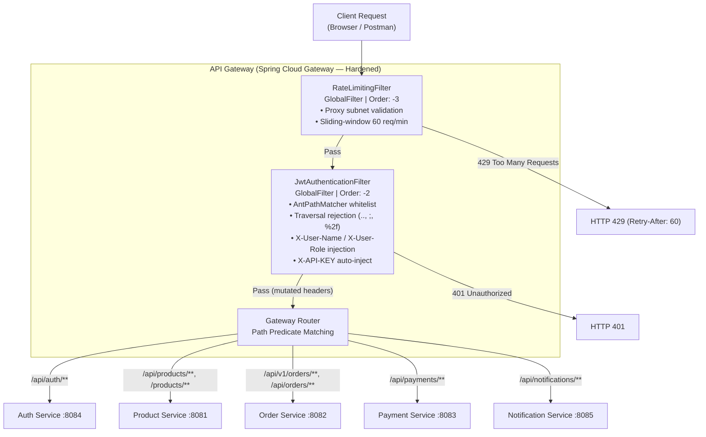
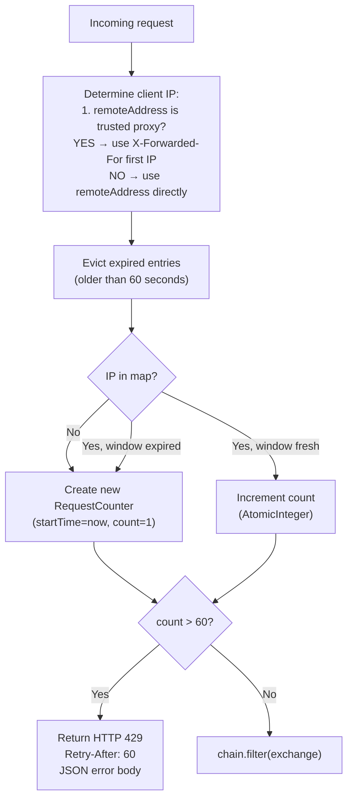

# API Gateway

## Overview

The API Gateway is the hardened single entry point for all external client requests. Built with **Spring Cloud Gateway** (reactive, non-blocking), it enforces anti-traversal path sanitization, JWT authentication, proxy-aware rate limiting, and auto-injects service credentials before routing to downstream microservices.

- **Port:** `8080`
- **Spring Boot Version:** `3.2.3`
- **Spring Cloud Version:** `2023.0.0`
- **Package:** `com.soc.apigateway`

---

## Internal Component Architecture



---

## RateLimitingFilter

**Class:** `com.soc.apigateway.filter.RateLimitingFilter`  
**Interface:** `GlobalFilter`, `Ordered`  
**Filter Order:** `-3` (executes first)

### Algorithm



### Implementation Details

| Property | Value |
|---|---|
| Max requests per window | `60` |
| Window duration | `60 seconds` |
| Counter storage | `ConcurrentHashMap<String, RequestCounter>` |
| Thread safety | `AtomicInteger` per IP counter |
| Trusted proxy detection | Loopback (`127.0.0.1`, `::1`) or RFC 1918 subnets (`10.x`, `172.16-31.x`, `192.168.x`) |
| Anti-spoofing | Direct public clients cannot inject fake `X-Forwarded-For` |

**Error Response (HTTP 429):**
```json
{
  "error": "Too Many Requests",
  "message": "Rate limit of 60 requests per minute exceeded.",
  "status": 429
}
```

---

## JwtAuthenticationFilter

**Class:** `com.soc.apigateway.filter.JwtAuthenticationFilter`  
**Interface:** `GlobalFilter`, `Ordered`  
**Filter Order:** `-2` (executes second)

### Open Endpoints (No JWT Required)

Matched with `AntPathMatcher` (exact prefix match — prevents substring bypass):

| Path Pattern | Purpose |
|---|---|
| `/api/auth/register` | User registration |
| `/api/auth/login` | User login |
| `/api/auth/validate` | Token validation utility |
| `/swagger-ui` | Swagger documentation UI |
| `/v3/api-docs` | OpenAPI specification |
| `/api-docs` | OpenAPI specification |

### Token Validation & Traversal Protection Flow

1. **Anti-traversal check** — Reject paths containing `..`, `;`, or `%2f`. Return `401`.
2. Check if path matches any whitelisted open endpoint (via `AntPathMatcher.match`) — if yes, skip filter.
3. Check for `Authorization` header — return `401` if missing.
4. Verify header starts with `Bearer ` — return `401` if not.
5. Extract token (substring after `"Bearer "`).
6. Parse JWT using `Jwts.parserBuilder().setSigningKey(HS256Key).build().parseClaimsJws(token)`.
7. Extract `subject` (username) and `role` claim.
8. Mutate request: add `X-User-Name`, `X-User-Role`, and `X-API-KEY` headers.
9. Forward mutated request downstream.

**Error Responses (HTTP 401):**
```json
{ "error": "Missing Authorization Header", "status": 401 }
{ "error": "Invalid Authorization Header Format", "status": 401 }
{ "error": "Invalid or Expired JWT Token", "status": 401 }
{ "error": "Forbidden path", "status": 401 }
```

---

## Route Configuration

Defined in `src/main/resources/application.yml`:

| Route ID | Path Predicates | Upstream URL (env var) | Default URL |
|---|---|---|---|
| `auth-service` | `/api/auth/**` | `${AUTH_SERVICE_URL}` | `http://localhost:8084` |
| `product-service` | `/api/products/**`, `/products/**` | `${PRODUCT_SERVICE_URL}` | `http://localhost:8081` |
| `order-service` | `/api/orders/**`, `/api/v1/orders/**` | `${ORDER_SERVICE_URL}` | `http://localhost:8082` |
| `payment-service` | `/api/payments/**` | `${PAYMENT_SERVICE_URL}` | `http://localhost:8083` |
| `notification-service` | `/api/notifications/**` | `${NOTIFICATION_SERVICE_URL}` | `http://localhost:8085` |

---

## CORS Configuration (Restricted)

```yaml
cors-configurations:
  '[/**]':
    allowedOrigins:
      - "http://localhost:3000"
      - "http://127.0.0.1:3000"
    allowedMethods: [GET, POST, PUT, PATCH, DELETE, OPTIONS]
    allowedHeaders: "*"
    exposedHeaders: [Authorization, X-API-KEY]
```

> Wildcard `allowedOrigins: "*"` has been replaced with explicit trusted origins to prevent cross-origin request forgery.

---

## API Keys Per Service

All keys are externalized to `.env` and loaded via Spring `@Value`:

| Service | Header | Config Key |
|---|---|---|
| Product Service | `X-API-KEY` | `api-keys.product-service` |
| Order Service | `X-API-KEY` | `api-keys.order-service` |
| Payment Service | `X-API-KEY` | `api-keys.payment-service` |
| Notification Service | `X-API-KEY` | `api-keys.notification-service` |

---

## Configuration Properties

| Property | Description |
|---|---|
| `jwt.secret` | BASE64-encoded HMAC-SHA256 signing key (from `.env`) |
| `api-keys.product-service` | Product service API key (from `.env`) |
| `api-keys.order-service` | Order service API key (from `.env`) |
| `api-keys.payment-service` | Payment service API key (from `.env`) |
| `api-keys.notification-service` | Notification service API key (from `.env`) |
| `AUTH_SERVICE_URL` | Auth service upstream URL |
| `PRODUCT_SERVICE_URL` | Product service upstream URL |
| `ORDER_SERVICE_URL` | Order service upstream URL |
| `PAYMENT_SERVICE_URL` | Payment service upstream URL |
| `NOTIFICATION_SERVICE_URL` | Notification service upstream URL |

---

## Maven Dependencies

| Artifact | Purpose |
|---|---|
| `spring-cloud-starter-gateway` | Reactive gateway core |
| `lombok` | Compile-time code generation |
| `jjwt-api` `0.11.5` | JWT API |
| `jjwt-impl` `0.11.5` | JWT implementation (runtime) |
| `jjwt-jackson` `0.11.5` | JWT JSON serialization (runtime) |
| `spring-boot-starter-test` | Unit testing (JUnit 5, Mockito) |
| `reactor-test` | WebFlux reactive testing |
| `dependency-check-maven` `9.0.9` | OWASP CVE scanning |

---

## Security Regression Tests

**Test Classes:**
- [`JwtAuthenticationFilterTest.java`](../../api-gateway/src/test/java/com/soc/apigateway/JwtAuthenticationFilterTest.java) — JWT expiry/tampering rejection, whitelist pass-through, path traversal protection.
- [`RateLimitingFilterTest.java`](../../api-gateway/src/test/java/com/soc/apigateway/RateLimitingFilterTest.java) — Rate limit threshold at 61 req/min, anti-spoofing IP extraction.
