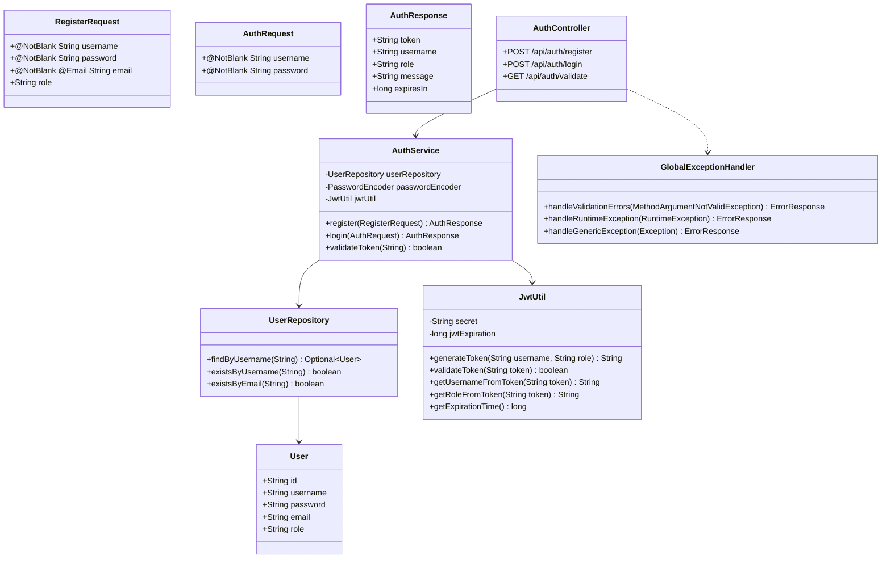
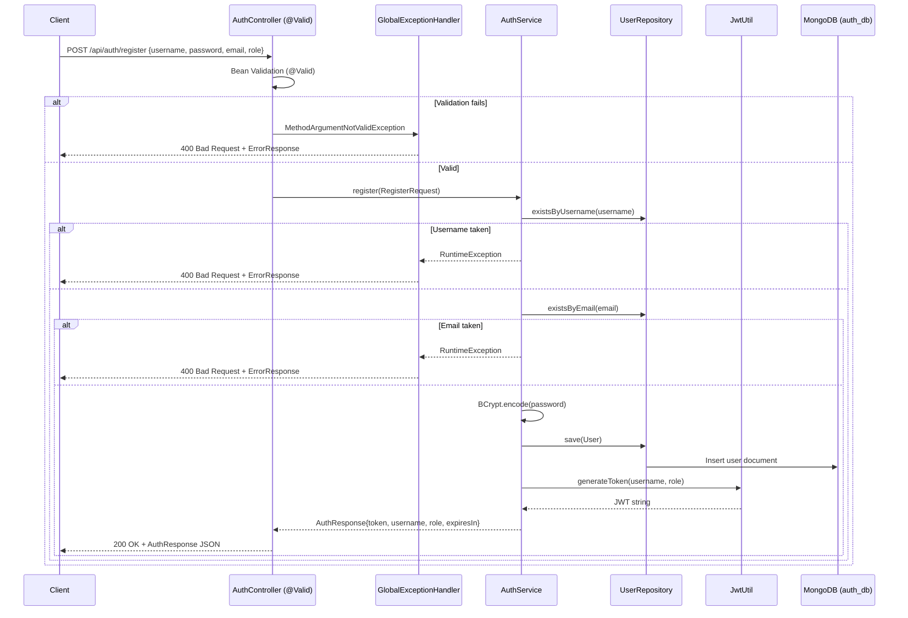

# Auth Service

## Overview

The Auth Service provides centralized user authentication and JWT token issuance for the entire platform. It is the only service that exposes public endpoints (no authentication required), making it the first stop in every user session. Input contracts are enforced with Jakarta Bean Validation, and errors are handled by a centralized `GlobalExceptionHandler` to prevent stack trace leakage.

- **Port:** `8084`
- **Database:** `auth_db` (MongoDB inside `soc-internal-net`)
- **Collections:** `users`, `api_keys`
- **Package:** `com.soc.authservice`
- **Data Seeding:** `DataInitializer` is gated behind `@Profile("!prod")` — will NOT run in production.

---

## Class Diagram



---

## REST API Endpoints

| Method | Endpoint | Auth | Request Body | Description |
|---|---|:---:|---|---|
| `POST` | `/api/auth/register` | Public | `RegisterRequest` | Register a new user account |
| `POST` | `/api/auth/login` | Public | `AuthRequest` | Authenticate and receive a JWT token |
| `GET` | `/api/auth/validate?token=...` | Public | None | Validate an existing JWT token |

---

## Input Validation

`RegisterRequest` and `AuthRequest` use Jakarta Bean Validation annotations:

| Field | Constraint | Error |
|---|---|---|
| `username` | `@NotBlank` | `"Username is required"` |
| `password` | `@NotBlank` | `"Password is required"` |
| `email` | `@NotBlank` + `@Email` | `"Valid email is required"` |

Invalid requests receive `HTTP 400` with an `ErrorResponse` body (no stack trace).

---

## User Registration Flow



---

## Request & Response Schemas

### POST `/api/auth/register`

**Request Body:**
```json
{
  "username": "john_doe",
  "password": "Password123!",
  "email": "john@example.com",
  "role": "ROLE_USER"
}
```
> The `role` field is optional. If omitted or blank, defaults to `ROLE_USER`.

**Success Response (`200 OK`):**
```json
{
  "token": "eyJhbGciOiJIUzI1NiJ9...",
  "username": "john_doe",
  "role": "ROLE_USER",
  "message": "User registered successfully",
  "expiresIn": 86400000
}
```

**Validation Error (`400 Bad Request`):**
```json
{
  "status": 400,
  "error": "Validation Failed",
  "message": "email: Valid email is required"
}
```

---

### POST `/api/auth/login`

**Request Body:**
```json
{
  "username": "john_doe",
  "password": "Password123!"
}
```

**Success Response (`200 OK`):**
```json
{
  "token": "eyJhbGciOiJIUzI1NiJ9...",
  "username": "john_doe",
  "role": "ROLE_USER",
  "message": "Authentication successful",
  "expiresIn": 86400000
}
```

---

## JWT Utility

**Class:** `com.soc.authservice.util.JwtUtil`

| Method | Description |
|---|---|
| `generateToken(username, role)` | Creates a signed HS256 JWT with `sub=username`, `role=role`, `iat`, `exp` |
| `validateToken(token)` | Returns `true` if signature valid and token not expired |
| `getUsernameFromToken(token)` | Extracts the `sub` claim |
| `getRoleFromToken(token)` | Extracts the `role` claim |
| `getExpirationTime()` | Returns configured expiration in milliseconds |

**Configuration (from `.env`):**
```yaml
jwt:
  secret: ${JWT_SECRET}      # BASE64-encoded HMAC key
  expiration: 86400000       # 24 hours in milliseconds
```

---

## Security Configuration

- **Password Encoding:** BCrypt (`BCryptPasswordEncoder`)
- **Spring Security:** Permits all requests — JWT validation is handled by the API Gateway, not the service itself.
- **Profile Gating:** `DataInitializer` annotated `@Profile("!prod")` — default accounts are never seeded in production.
- **Error Sanitization:** `GlobalExceptionHandler` logs full stack traces server-side; returns generic `500` messages to clients.

---

## Maven Dependencies

| Artifact | Purpose |
|---|---|
| `spring-boot-starter-web` | REST API support |
| `spring-boot-starter-data-mongodb` | MongoDB integration |
| `spring-boot-starter-security` | Security framework |
| `spring-boot-starter-validation` | Jakarta Bean Validation |
| `jjwt-api`, `jjwt-impl`, `jjwt-jackson` | JWT generation and validation |
| `lombok` | Boilerplate code generation |
| `spring-boot-starter-test` | Unit testing (JUnit 5, Mockito) |
| `dependency-check-maven` `9.0.9` | OWASP CVE scanning |
