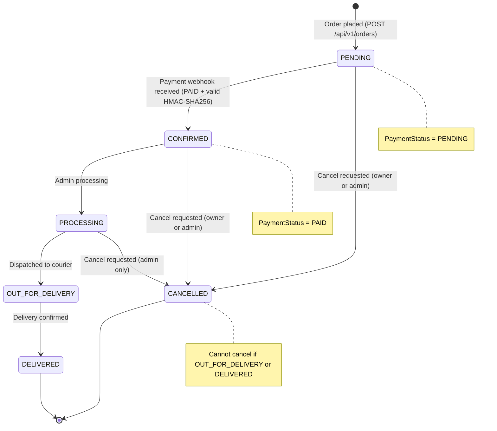
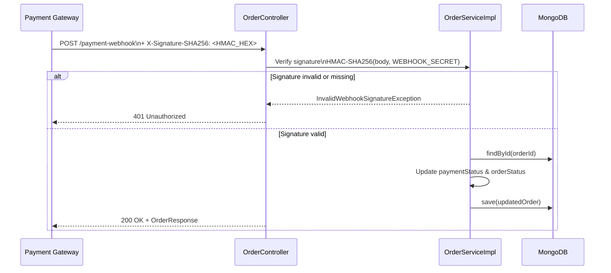

# Order Service

## Overview

The Order Service is the most feature-rich microservice in the platform. It handles the full order lifecycle — from placement and total calculation to HMAC-SHA256-verified payment callbacks, delivery dispatch tracking, ownership-validated reads, and cancellation. All write operations enforce customer identity matching (BOLA/IDOR protection).

- **Port:** `8082`
- **Database:** `order_db` (MongoDB inside `soc-internal-net`)
- **Collection:** `orders`
- **Package:** `com.ecommerce.orderservice`
- **Swagger UI:** `http://localhost:8082/swagger-ui.html`
- **Actuator:** `http://localhost:8082/actuator/health`

---

## Order Status Lifecycle



---

## Payment Webhook Security

All `POST /api/v1/orders/{id}/payment-webhook` requests must include an `X-Signature-SHA256` header:



---

## Class Diagram

```mermaid
classDiagram
    class Order {
        +String id
        +String orderNumber
        +String customerId
        +String customerEmail
        +String customerPhone
        +Address shippingAddress
        +List~OrderItem~ items
        +BigDecimal totalAmount
        +OrderStatus orderStatus
        +PaymentStatus paymentStatus
        +String transactionId
        +DeliveryInfo deliveryInfo
        +LocalDateTime createdAt
        +LocalDateTime updatedAt
    }

    class OrderItem {
        +String productId
        +String productName
        +BigDecimal unitPrice
        +int quantity
        +BigDecimal subtotal
    }

    class Address {
        +@NotBlank String street
        +@NotBlank String city
        +@NotBlank String state
        +@NotBlank String zipCode
        +@NotBlank String country
    }

    class DeliveryInfo {
        +String carrier
        +String trackingNumber
        +DeliveryStatus deliveryStatus
        +LocalDateTime estimatedDeliveryTime
        +String dispatchNotes
    }

    class OrderService {
        <<interface>>
        +createOrder(CreateOrderRequest) OrderResponse
        +getOrderByIdOrNumber(String, String, String) OrderResponse
        +getAllOrders(String, OrderStatus, Pageable) Page~OrderResponse~
        +updateOrderStatus(String, UpdateOrderStatusRequest) OrderResponse
        +processPaymentWebhook(String, PaymentWebhookRequest, String) OrderResponse
        +updateDeliveryDetails(String, UpdateDeliveryRequest) OrderResponse
        +cancelOrder(String, String, String) void
    }

    class OrderServiceImpl {
        -OrderRepository orderRepository
        -String webhookSecret
        +createOrder(CreateOrderRequest) OrderResponse
        +processPaymentWebhook(String, PaymentWebhookRequest, String) OrderResponse
        -verifySignature(String body, String signature) boolean
        -generateOrderNumber() String
        -mapToResponse(Order) OrderResponse
    }

    class OrderController {
        +POST /api/v1/orders
        +GET /api/v1/orders
        +GET /api/v1/orders/{id}
        +PATCH /api/v1/orders/{id}/status
        +POST /api/v1/orders/{id}/payment-webhook
        +PATCH /api/v1/orders/{id}/delivery
        +DELETE /api/v1/orders/{id}
    }

    Order "1" --> "many" OrderItem
    Order --> Address
    Order --> DeliveryInfo
    OrderController --> OrderService
    OrderServiceImpl ..|> OrderService
    OrderServiceImpl --> OrderRepository
```

---

## REST API Endpoints

| Method | Endpoint | Description | Auth | Authorization |
|---|---|---|---|---|
| `POST` | `/api/v1/orders` | Place a new order | JWT Bearer | Any authenticated user |
| `GET` | `/api/v1/orders/{id}` | Get order by ID or order number | JWT Bearer | Owner (`customerId`) or `ROLE_ADMIN` |
| `GET` | `/api/v1/orders` | List orders (paginated, filterable) | JWT Bearer | Own orders or all (Admin) |
| `PATCH` | `/api/v1/orders/{id}/status` | Update order status | JWT Bearer | JWT Bearer |
| `POST` | `/api/v1/orders/{id}/payment-webhook` | Receive payment callback | `X-Signature-SHA256` | Valid HMAC-SHA256 signature required |
| `PATCH` | `/api/v1/orders/{id}/delivery` | Update courier tracking details | JWT Bearer | JWT Bearer |
| `DELETE` | `/api/v1/orders/{id}` | Cancel an order | JWT Bearer | Owner or `ROLE_ADMIN` |
| `GET` | `/actuator/health` | Health check | None | None |

---

## BOLA/IDOR Ownership Protection

The order service validates that the requesting user (`X-User-Name` header) matches the `customerId` of the resource before returning or modifying it. Admins (`ROLE_ADMIN`) are exempt from this check:

```java
if (!order.getCustomerId().equals(callerUsername) && !"ROLE_ADMIN".equals(callerRole)) {
    throw new AccessDeniedException("You are not authorized to access this order");
}
```

---

## Exception Handling

| Exception | HTTP Status | Description |
|---|:---:|---|
| `ResourceNotFoundException` | `404` | Order not found by ID or order number |
| `InvalidOrderStatusException` | `400` | Illegal status transition |
| `InvalidWebhookSignatureException` | `401` | Missing or invalid HMAC-SHA256 webhook signature |
| General exceptions | `500` | Unexpected server errors (sanitized response, full log server-side) |

**Global exception handler:** `com.ecommerce.orderservice.exception.GlobalExceptionHandler`

---

## Order Number Format

```
ORD-{YYYYMMDD}-{XXXXXX}

Examples:
  ORD-20260822-A1B2C3
  ORD-20260901-F9E8D7
```

---

## Configuration (`application.yml`)

```yaml
server:
  port: ${SERVER_PORT:8082}

spring:
  application:
    name: order-service
  data:
    mongodb:
      uri: ${SPRING_DATA_MONGODB_URI:mongodb://localhost:27019/order_db}
      auto-index-creation: true

webhook:
  secret: ${WEBHOOK_SECRET:default-dev-secret}

management:
  endpoints:
    web:
      exposure:
        include: health,info,metrics
```
