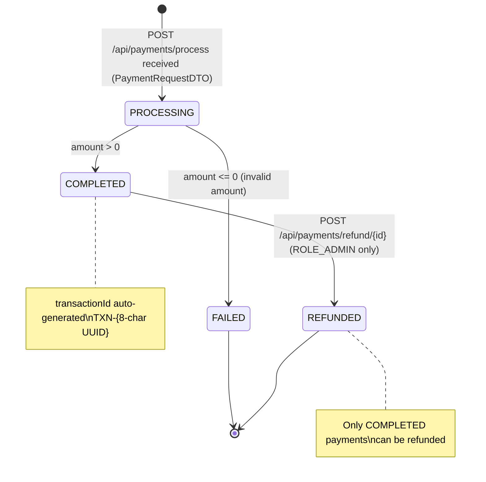

# Payment Service

## Overview

The Payment Service processes financial transactions, maintains a full audit history of payments, and supports refund operations. All business logic is decoupled using Data Transfer Objects (DTOs) with strict Bean Validation, centralized exception handling, and role/identity-based access control.

- **Port:** `8083`
- **Database:** `payment_db` (MongoDB inside `soc-internal-net`)
- **Collection:** `payments`
- **Package:** `com.soc.paymentservice`
- **Security:** `X-API-KEY: payment-secret-key-123` (Constant-Time Verification) + `ROLE_ADMIN` checks for refunds + Ownership check for payment history.

---

## Payment Status Lifecycle



---

## Class Diagram

```mermaid
classDiagram
    class Payment {
        +String id
        +String transactionId
        +Long orderId
        +Long userId
        +BigDecimal amount
        +String paymentMethod
        +String status
        +String currency
        +String notes
        +LocalDateTime createdAt
        +LocalDateTime updatedAt
    }

    class PaymentRequestDTO {
        +Long orderId
        +Long userId
        +BigDecimal amount
        +String paymentMethod
        +String currency
        +String notes
    }

    class PaymentResponseDTO {
        +String id
        +String transactionId
        +Long orderId
        +Long userId
        +BigDecimal amount
        +String paymentMethod
        +String status
        +String currency
        +String notes
        +LocalDateTime createdAt
        +LocalDateTime updatedAt
    }

    class PaymentRepository {
        +findByUserId(Long) List~Payment~
        +findByOrderId(Long) List~Payment~
        +findByTransactionId(String) Optional~Payment~
    }

    class PaymentService {
        -PaymentRepository paymentRepository
        +processPayment(PaymentRequestDTO) PaymentResponseDTO
        +getPaymentHistoryByUserId(Long) List~PaymentResponseDTO~
        +getPaymentById(String) Optional~PaymentResponseDTO~
        +getPaymentByTransactionId(String) Optional~PaymentResponseDTO~
        +refundPayment(String id, String reason) Optional~PaymentResponseDTO~
    }

    class PaymentController {
        -PaymentService paymentService
        +POST /api/payments/process
        +GET /api/payments/history/{userId}
        +GET /api/payments/{id}
        +GET /api/payments/transaction/{transactionId}
        +POST /api/payments/refund/{id}
    }

    class ApiKeyFilter {
        -API_KEY_HEADER: String
        -validApiKey: String
        +doFilter(request, response, chain) void
    }

    PaymentController --> PaymentService
    PaymentService --> PaymentRepository
    PaymentService ..> PaymentRequestDTO
    PaymentService ..> PaymentResponseDTO
    PaymentRepository --> Payment
    ApiKeyFilter ..> PaymentController : "guards"
```

---

## REST API Endpoints

| Method | Endpoint | Description | Request Body | Response | Authorization Required |
|---|---|---|---|---|:---:|
| `POST` | `/api/payments/process` | Process a new payment | `PaymentRequestDTO` | `201 Created` — `PaymentResponseDTO` | `X-API-KEY` / JWT |
| `GET` | `/api/payments/history/{userId}` | Get all payments for a user | None | `200 OK` — `List<PaymentResponseDTO>` | Owner (`X-User-Name`) or `ROLE_ADMIN` |
| `GET` | `/api/payments/{id}` | Get payment by MongoDB ID | None | `200 OK` — `PaymentResponseDTO` | `X-API-KEY` / JWT |
| `GET` | `/api/payments/transaction/{transactionId}` | Get payment by transaction ID | None | `200 OK` — `PaymentResponseDTO` | `X-API-KEY` / JWT |
| `POST` | `/api/payments/refund/{id}` | Process a refund by payment ID | `Map<String, String>` (reason) | `200 OK` — `PaymentResponseDTO` | `ROLE_ADMIN` |

---

## Sample Request & Response

### POST `/api/payments/process`

**Request:**
```json
{
  "orderId": 1001,
  "userId": 1,
  "amount": 300.00,
  "paymentMethod": "CREDIT_CARD",
  "currency": "LKR",
  "notes": "Order checkout"
}
```

**Response (`201 Created`):**
```json
{
  "id": "64d4e5f6001234567890ab",
  "transactionId": "TXN-A1B2C3D4",
  "orderId": 1001,
  "userId": 1,
  "amount": 300.00,
  "paymentMethod": "CREDIT_CARD",
  "status": "COMPLETED",
  "currency": "LKR",
  "notes": "Order checkout",
  "createdAt": "2026-08-22T22:10:00",
  "updatedAt": "2026-08-22T22:10:00"
}
```

---

## Swagger / OpenAPI

- **Swagger UI:** `http://localhost:8083/swagger-ui.html`
- **OpenAPI Spec:** `http://localhost:8083/v3/api-docs`
- **Security Scheme:** `ApiKeyAuth` (header `X-API-KEY`)
