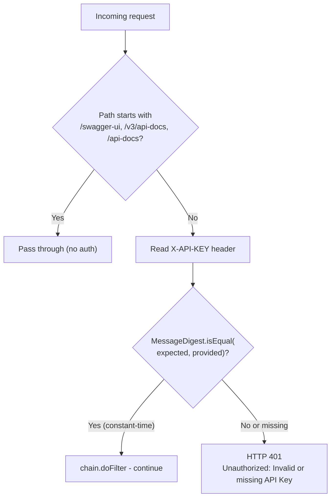

# Product Service

## Overview

The Product Service manages the product catalog for the e-commerce platform. It provides full CRUD operations for product inventory. Write and delete operations are protected by `ROLE_ADMIN` RBAC enforcement. API key validation uses constant-time byte comparison (`MessageDigest.isEqual`) to prevent timing attacks. Default data seeding is gated behind `@Profile("!prod")`.

- **Port:** `8081`
- **Database:** `product_db` (MongoDB inside `soc-internal-net`)
- **Collection:** `products`
- **Package:** `com.soc.productservice`
- **Security:** Constant-time `X-API-KEY` validation + `ROLE_ADMIN` header check on `POST` / `DELETE`

---

## Class Diagram

```mermaid
classDiagram
    class Product {
        +String id
        +@NotBlank String name
        +@NotBlank String description
        +@Positive double price
        +@Min(0) int stockQuantity
    }

    class ProductRepository {
        +findAll() List~Product~
        +findById(String) Optional~Product~
        +save(Product) Product
        +deleteById(String) void
    }

    class ProductService {
        -ProductRepository repository
        +getAllProducts() List~Product~
        +getProductById(String id) Product
        +createProduct(Product product) Product
        +deleteProduct(String id) void
    }

    class ProductController {
        -ProductService service
        +GET /products() ResponseEntity
        +GET /products/{id}() ResponseEntity
        +POST /products() ResponseEntity
        +DELETE /products/{id}() ResponseEntity
    }

    class ApiKeyFilter {
        -API_KEY_HEADER: String
        -validApiKey: String
        +doFilter(request, response, chain) void
    }

    class DataInitializer {
        -@Profile("!prod") DataInitializer
        -ProductRepository repository
        +run(args) void
    }

    class GlobalExceptionHandler {
        +handleValidationErrors(MethodArgumentNotValidException) ErrorResponse
        +handleRuntimeException(RuntimeException) ErrorResponse
        +handleGenericException(Exception) ErrorResponse
    }

    ProductController --> ProductService
    ProductController ..> GlobalExceptionHandler
    ProductService --> ProductRepository
    ProductRepository --> Product
    ApiKeyFilter ..> ProductController : "guards"
    DataInitializer --> ProductRepository
```

---

## REST API Endpoints

All endpoints require the `X-API-KEY` header (auto-injected by the API Gateway). Write/delete operations additionally require `ROLE_ADMIN`.

| Method | Endpoint | Description | Response | Role Required |
|---|---|---|---|:---:|
| `GET` | `/products` | Retrieve all products | `200 OK` — `List<Product>` | Any |
| `GET` | `/products/{id}` | Get a single product by ID | `200 OK` — `Product` | Any |
| `POST` | `/products` | Create a new product | `201 Created` — `Product` | `ROLE_ADMIN` |
| `DELETE` | `/products/{id}` | Delete a product by ID | `204 No Content` | `ROLE_ADMIN` |

**Gateway Paths (via API Gateway):**
- `/api/products/**` or `/products/**` → routed to `:8081`

---

## API Key Filter (Hardened)

**Class:** `com.soc.productservice.config.ApiKeyFilter`



> Uses `MessageDigest.isEqual(expectedBytes, providedBytes)` for constant-time comparison, preventing timing side-channel attacks.

---

## Role-Based Access Control

`ProductController` extracts `X-User-Role` from the forwarded header (injected by the API Gateway JWT filter):

```java
// POST /products — Admin only
if (!"ROLE_ADMIN".equals(userRole)) {
    return ResponseEntity.status(HttpStatus.FORBIDDEN)
        .body("Access denied: Admin role required");
}

// DELETE /products/{id} — Admin only
if (!"ROLE_ADMIN".equals(userRole)) {
    return ResponseEntity.status(HttpStatus.FORBIDDEN)
        .body("Access denied: Admin role required");
}
```

---

## Input Validation

`Product` model uses Jakarta Bean Validation annotations:

| Field | Constraint |
|---|---|
| `name` | `@NotBlank` |
| `description` | `@NotBlank` |
| `price` | `@Positive` |
| `stockQuantity` | `@Min(0)` |

Invalid requests return `HTTP 400` with an `ErrorResponse` body.

---

## Data Initializer

**Class:** `com.soc.productservice.config.DataInitializer`  
**Annotation:** `@Profile("!prod")` — will NOT run when `spring.profiles.active=prod`.

On application startup (in dev/default profile), if the `products` collection is empty, seeds the database with sample product records.

---

## Swagger UI

- **Swagger UI:** `http://localhost:8081/swagger-ui.html`
- **OpenAPI Spec:** `http://localhost:8081/v3/api-docs`

---

## Maven Dependencies

| Artifact | Purpose |
|---|---|
| `spring-boot-starter-web` | REST API support |
| `spring-boot-starter-data-mongodb` | MongoDB integration |
| `spring-boot-starter-validation` | Jakarta Bean Validation |
| `springdoc-openapi-starter-webmvc-ui` | Swagger UI |
| `lombok` | Boilerplate code generation |
| `spring-boot-starter-test` | Unit testing (JUnit 5, Mockito) |
| `dependency-check-maven` `9.0.9` | OWASP CVE scanning |
